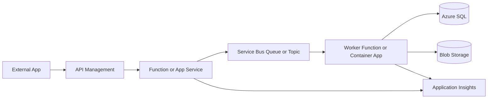

# Azure Services Cheat Sheet

[![Azure][badge-azure]][docs-azure] [![.NET][badge-dotnet]][docs-dotnet]
[![DevOps][badge-devops]][docs-devops]
[![Architecture][badge-architecture]][docs-architecture]
[![Markdown Check][badge-markdown-check]][workflow-markdown-check]
[![Contributions Welcome][badge-contrib]][contributing]

Practical Azure integration decisions, patterns, and production notes.

The focus is deliberately narrow:

- APIs.
- Messaging.
- Event-driven integration.
- Service Bus.
- Azure Functions.
- Logic Apps.
- API Management.
- Blob Storage claim-check patterns.
- Key Vault and Managed Identity.
- Azure DevOps.
- Monitoring and operational maturity.
- Dataverse / Dynamics 365 integration.

This is not an encyclopedia of Azure services. It is a working reference for
choosing integration services, spotting trade-offs, and avoiding the problems
that usually appear after systems go live.

Built from real-world Azure integration and Dynamics 365 delivery experience,
with a focus on production-oriented patterns.

## Quick Service Selection

| Need                           | I would usually start with     |
| ------------------------------ | ------------------------------ |
| Durable async command          | Service Bus Queue              |
| Durable pub/sub                | Service Bus Topic              |
| Lightweight event notification | Event Grid                     |
| High-volume telemetry stream   | Event Hubs                     |
| Public API boundary            | API Management                 |
| Custom integration code        | Azure Functions or App Service |
| Connector-heavy workflow       | Logic Apps                     |
| Large payload handoff          | Blob Storage claim check       |
| Secrets                        | Key Vault                      |
| Azure-to-Azure auth            | Managed Identity               |
| Operational tracing            | Application Insights           |
| Cross-resource log queries     | Log Analytics                  |

Avoid turning every integration into a synchronous HTTP chain. It works well
until one dependency slows down, starts throttling, or needs replay.

## Start Here

- [Service Selection Guide](docs/service-selection-guide.md)
- [Architecture Recipes](recipes/README.md)
- [Production Readiness Checklist](docs/production-readiness-checklist.md)
- [Messaging](docs/messaging.md)
- [Integration](docs/integration.md)
- [Monitoring](docs/monitoring.md)

## Featured Architecture Recipes

The recipes are the most practical part of this repo.

| Recipe | Use when |
| --- | --- |
| [Public API to Service Bus](recipes/public-api-to-service-bus.md) | Accept now, process later. |
| [Dataverse to Service Bus](recipes/dataverse-to-service-bus.md) | Decouple Dataverse work. |
| [Blob Claim-Check](recipes/blob-claim-check-pattern.md) | Reference large payloads. |
| [DMZ-Safe Document Ingestion](recipes/dmz-safe-document-ingestion.md) | Validate external uploads. |
| [Enterprise Secure Integration Stack](recipes/enterprise-secure-integration-stack.md) | Governed API and messaging. |

## Core Azure Integration Patterns

- API Management to Function to Service Bus to worker.
- Dataverse to Service Bus to Azure Function.
- Queue-based load leveling.
- Service Bus topic fan-out.
- Blob claim-check for large payloads.
- DMZ-safe document upload.
- Outbox for database-to-message consistency.
- Correlation IDs across APIs, queues, workers, and logs.

## Production Notes

The first thing that usually breaks is not the happy path. It is supportability.

Watch for:

- Service Bus DLQs without alerts.
- Message handlers that are not idempotent.
- Correlation IDs lost at async boundaries.
- Retry policies that amplify downstream throttling.
- Secrets copied into app settings or pipelines.
- Private endpoints added before DNS is understood.
- Logic Apps that become hard to review once custom logic grows.

## Typical Integration Flow

## Practical Decision Guides

- [Service Bus vs Event Grid vs Event Hubs](docs/messaging.md#service-bus-vs-event-grid-vs-event-hubs)
- [Functions vs App Service vs Container Apps](docs/integration.md#functions-vs-app-service-vs-container-apps)
- [Logic Apps vs Durable Functions](docs/integration.md#logic-apps-vs-durable-functions)
- [Key Vault vs App Configuration](docs/identity-security.md#key-vault-vs-app-configuration)
- [What I Would Usually Choose](docs/service-selection-guide.md#what-i-would-usually-choose)

## Docs

- [Docs Index](docs/README.md)
- [Messaging](docs/messaging.md)
- [Integration](docs/integration.md)
- [Architecture Patterns](docs/architecture-patterns.md)
- [Service Selection Guide](docs/service-selection-guide.md)
- [Production Readiness Checklist](docs/production-readiness-checklist.md)
- [Monitoring](docs/monitoring.md)
- [Identity & Security](docs/identity-security.md)
- [DevOps](docs/devops.md)
- [Gotchas](docs/gotchas.md)

Broader Azure topics are still covered, but briefly:

- [Compute](docs/compute.md)
- [Storage](docs/storage.md)
- [Networking](docs/networking.md)
- [Databases](docs/databases.md)

## Snippets And Examples

- [Snippets Index](snippets/README.md)
- [Azure CLI](snippets/azure-cli.md)
- [Bicep](snippets/bicep.md)
- [PowerShell](snippets/powershell.md)
- [.NET](snippets/dotnet.md)
- [DevOps YAML](snippets/devops-yaml.md)

## Diagrams

- [Diagram Index](diagrams/README.md)
- [Architecture Recipes](recipes/README.md)

## Contributing

Contributions are welcome when they stay practical and field-tested.

Good additions include:

- Real-world gotchas.
- Decision tables.
- Secure defaults.
- Production snippets.
- Small architecture recipes.
- Links to official Microsoft documentation where they help.

See [CONTRIBUTING.md](CONTRIBUTING.md).

## Related Repositories

- [Dynamics 365 Developer Cheat Sheet](https://github.com/brunsdon/dynamics365-developer-cheat-sheet)
- [Power Platform Integration Patterns](https://github.com/brunsdon/power-platform-integration-patterns)
- [Power Pages Cheat Sheet](https://github.com/brunsdon/power-pages-cheat-sheet)
- [Dataverse Schema Design Guide](https://github.com/brunsdon/dataverse-schema-design-guide)

## Suggested GitHub Topics

`azure`, `azure-functions`, `azure-service-bus`, `azure-architecture`,
`cloud-architecture`, `dotnet`, `integration-patterns`, `azure-devops`,
`api-management`, `event-driven-architecture`, `service-bus`, `serverless`,
`cloud-native`, `microservices`, `power-platform`, `dynamics365`

## License

MIT. See [LICENSE](LICENSE).

[badge-azure]:
  https://img.shields.io/badge/Azure-Services-0078D4?logo=microsoftazure&logoColor=white
[badge-dotnet]:
  https://img.shields.io/badge/.NET-Integration-512BD4?logo=dotnet&logoColor=white
[badge-devops]:
  https://img.shields.io/badge/DevOps-CI%2FCD-0A66C2?logo=azuredevops&logoColor=white
[badge-architecture]: https://img.shields.io/badge/Architecture-Patterns-2E7D32
[badge-markdown-check]:
  https://github.com/brunsdon/azure-services-cheat-sheet/actions/workflows/markdown-check.yml/badge.svg
[badge-contrib]:
  https://img.shields.io/badge/contributions-welcome-brightgreen.svg
[docs-azure]: https://learn.microsoft.com/azure/
[docs-dotnet]: https://learn.microsoft.com/dotnet/
[docs-devops]: docs/devops.md
[docs-architecture]: docs/architecture-patterns.md
[workflow-markdown-check]:
  https://github.com/brunsdon/azure-services-cheat-sheet/actions/workflows/markdown-check.yml
[contributing]: CONTRIBUTING.md
