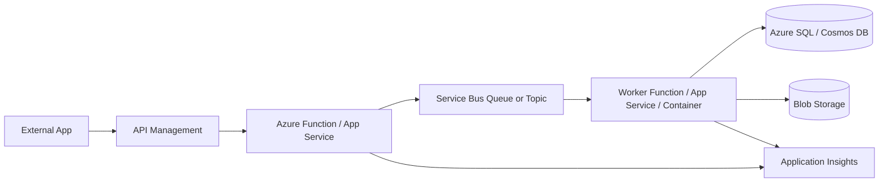

# Azure Services Cheat Sheet

A practical field guide for choosing, using, and integrating Azure services. This is written for real delivery work: APIs, queues, serverless jobs, Dynamics 365 / Dataverse integration, secure enterprise connectivity, CI/CD, observability, and the trade-offs that show up once systems are live.

No marketing fluff. Just what each service is good at, when to avoid it, common patterns, gotchas, security notes, and implementation snippets.

## Who This Is For

- Developers building .NET APIs, Azure Functions, workers, and integration services.
- Dynamics 365 and Power Platform specialists integrating Dataverse with Azure.
- Solution architects choosing between Azure services under real constraints.
- Technical leads reviewing designs, cost, reliability, and operational readiness.
- Integration specialists working with Service Bus, Logic Apps, API Management, Blob Storage, and enterprise systems.

## Azure Service Map

| Category | Services | Use when |
| --- | --- | --- |
| Compute | App Service, Azure Functions, Container Apps, AKS, VMs | You need to run APIs, jobs, containers, event handlers, or long-running workloads. |
| Storage | Blob Storage, Data Lake Storage, Files, Queues, Tables | You need files, documents, data lake zones, simple queues, or low-cost object storage. |
| Integration | Logic Apps, Functions, API Management, Event Grid, Durable Functions | You need workflow, orchestration, API mediation, system integration, or event routing. |
| Messaging | Service Bus, Event Grid, Event Hubs, Storage Queues | You need async messaging, pub/sub, event notification, telemetry ingestion, or buffering. |
| Identity & Security | Entra ID, Managed Identity, Key Vault, RBAC, Private Link | You need auth, secret management, least privilege, private access, or workload identity. |
| Databases | Azure SQL, Cosmos DB, PostgreSQL, Redis, Table Storage | You need relational, globally distributed NoSQL, cache, or simple key-value storage. |
| Monitoring | Azure Monitor, Application Insights, Log Analytics, Alerts | You need telemetry, traces, logs, dashboards, alerting, and production diagnosis. |
| DevOps | Azure DevOps, GitHub Actions, Bicep, deployment slots | You need repeatable build, test, deploy, promotion, and infrastructure automation. |
| Networking | VNets, Private Endpoints, DNS, Load Balancer, Application Gateway, Front Door | You need secure connectivity, ingress, egress control, routing, and private service access. |

## Typical Enterprise Integration

## Most Common Real-World Choices

| Choice | Default answer | Use the other option when |
| --- | --- | --- |
| App Service vs Functions vs Container Apps | App Service for APIs, Functions for event-driven work, Container Apps for containerized services and workers. | Use AKS only when you genuinely need Kubernetes control and platform maturity. |
| Service Bus vs Event Grid vs Event Hubs | Service Bus for commands and business messages. | Event Grid for notifications; Event Hubs for high-volume telemetry streams. |
| Blob Storage vs Data Lake | Blob Storage for files, documents, and claim-check payloads. | Data Lake when analytics, hierarchical namespace, and big-data access patterns matter. |
| SQL Database vs Cosmos DB | SQL Database for relational consistency and reporting-friendly models. | Cosmos DB when partitioned, low-latency, globally distributed NoSQL is required. |
| Key Vault vs App Configuration | Key Vault for secrets, certificates, and keys. | App Configuration for non-secret feature flags and runtime configuration. |
| Logic Apps vs Functions | Logic Apps for workflow and connector-heavy integration. | Functions for code-heavy logic, custom protocols, performance-sensitive handlers, and testable domain logic. |

## Docs

- [Compute](docs/compute.md)
- [Storage](docs/storage.md)
- [Integration](docs/integration.md)
- [Messaging](docs/messaging.md)
- [Identity & Security](docs/identity-security.md)
- [Networking](docs/networking.md)
- [Databases](docs/databases.md)
- [Monitoring](docs/monitoring.md)
- [DevOps](docs/devops.md)
- [Architecture Patterns](docs/architecture-patterns.md)
- [Service Selection Guide](docs/service-selection-guide.md)
- [Gotchas](docs/gotchas.md)
- [Diagrams](diagrams/README.md)

## Snippets

- [Azure CLI](snippets/azure-cli.md)
- [Bicep](snippets/bicep.md)
- [PowerShell](snippets/powershell.md)
- [.NET](snippets/dotnet.md)

## Contributing

Contributions are welcome when they keep the repo practical, concise, and field-tested. Good additions include real-world gotchas, decision tables, secure defaults, short snippets, and links to official Microsoft documentation where they help.

See [CONTRIBUTING.md](CONTRIBUTING.md).

## Related Repositories

- [Dynamics 365 Developer Cheat Sheet](https://github.com/brunsdon/dynamics365-developer-cheat-sheet)
- [Power Platform Integration Patterns](https://github.com/brunsdon/power-platform-integration-patterns)
- [Power Pages Cheat Sheet](https://github.com/brunsdon/power-pages-cheat-sheet)
- [Dataverse Schema Design Guide](https://github.com/brunsdon/dataverse-schema-design-guide)

## Author

Maintained by Matthew Brunsdon.

## License

MIT. See [LICENSE](LICENSE).
