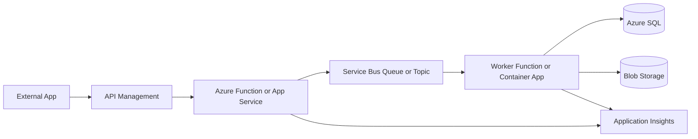

# Azure Services Cheat Sheet

A practical Azure architecture field guide for choosing, using, and
integrating Azure services in real delivery work.

This repository is written for developers, integration specialists, solution
architects, technical leads, and Dynamics 365 / Power Platform professionals
who need clear service selection guidance without marketing noise.

## Why This Repo Exists

Azure has many overlapping services. The hard part is rarely finding a service
that can work. The hard part is choosing the service that fits the workload,
team, cost model, security posture, and operational reality.

This cheat sheet focuses on production-minded decisions:

- When to use a service.
- When not to use it.
- What usually goes wrong.
- How to secure and monitor it.
- How it fits into integration-heavy enterprise systems.

## Who This Is For

| Audience | What you get |
| --- | --- |
| Azure developers | Practical defaults for APIs, Functions, queues, storage, identity, and CI/CD. |
| Solution architects | Decision tables, trade-offs, diagrams, and architecture patterns. |
| Technical leads | Delivery checklists, production gotchas, and operational review points. |
| Dynamics 365 / Power Platform developers | Dataverse integration guidance using Service Bus, Functions, Logic Apps, and API Management. |
| Recruiters and managers | A quick view of hands-on Azure integration, architecture, and delivery knowledge. |

## 🧭 Fast Path: Choosing The Right Azure Service

| Need | Start with | Consider instead when |
| --- | --- | --- |
| Run a web API | App Service | Use Functions for event handlers; Container Apps for container-first workloads. |
| Run event-driven code | Azure Functions | Use App Service or Container Apps for long-running services. |
| Buffer business work | Service Bus Queue | Use Event Grid for notification; Event Hubs for streaming telemetry. |
| Publish to multiple business consumers | Service Bus Topic | Use Event Grid when subscribers only need event notification. |
| Store files or payloads | Blob Storage | Use Data Lake Storage for analytics zones and big-data access. |
| Store relational data | Azure SQL Database | Use Cosmos DB for partitioned, globally distributed NoSQL workloads. |
| Store secrets | Key Vault | Use App Configuration for non-secret settings and feature flags. |
| Build connector-heavy workflow | Logic Apps | Use Durable Functions when orchestration needs code-first control. |
| Put a boundary in front of APIs | API Management | Use Front Door or Application Gateway for broader ingress/WAF scenarios. |
| Observe production behavior | Application Insights | Use Log Analytics for cross-resource KQL and diagnostic logs. |

See the full [Service Selection Guide](docs/service-selection-guide.md).

## Real-World Azure Integration Focus

This repo is intentionally biased toward the integration patterns that show up
in enterprise delivery:

- Azure Service Bus queues, topics, subscriptions, DLQs, sessions, retries, and
  duplicate detection.
- Azure Functions for HTTP APIs, timers, Service Bus processors, and Event Grid
  handlers.
- API Management for API governance, OAuth/JWT validation, throttling, and
  partner-facing contracts.
- Logic Apps for connector-heavy workflow, approvals, and enterprise
  orchestration.
- Blob Storage for document ingestion, export, archiving, and claim-check
  payloads.
- Key Vault and Managed Identity for secretless Azure-to-Azure authentication.
- Azure DevOps and GitHub Actions for build, validation, environment promotion,
  and repeatable Bicep deployments.
- Dataverse / Dynamics 365 integration using queues, webhooks, plugins,
  application users, and least-privilege access.
- Event-driven architecture and DMZ-safe upload patterns for secure enterprise
  boundaries.

## Common Enterprise Azure Stacks

| Scenario | Typical stack | Why it works |
| --- | --- | --- |
| Partner API integration | API Management, App Service or Functions, Service Bus, Key Vault, Application Insights | Separates API contract, processing, secrets, and async reliability. |
| Dataverse async integration | Dataverse plugin or Power Automate, Service Bus Topic, Azure Function worker, SQL or Blob Storage | Keeps Dataverse transactions short and gives Azure-side retry/monitoring. |
| Document ingestion | Blob Storage, Event Grid, Azure Function, Service Bus, worker service, Defender or malware scan | Creates a controlled landing zone before internal processing. |
| Workflow automation | Logic Apps, API Management, Key Vault, Service Bus, Function helpers | Uses connectors for workflow while keeping complex logic in code. |
| Containerized worker platform | Container Apps, Service Bus scaler, Managed Identity, Key Vault, Log Analytics | Good balance between container packaging and low platform overhead. |
| Enterprise API platform | Front Door or Application Gateway, API Management, App Service, Private Endpoints, App Insights | Provides ingress, governance, private backends, and telemetry. |

## Recruiter / Manager Quick Summary

This repository demonstrates practical knowledge across:

- Azure architecture and service selection.
- .NET APIs, Azure Functions, workers, and integration services.
- Azure Service Bus, Event Grid, Event Hubs, and event-driven design.
- API Management, Logic Apps, Blob Storage, Key Vault, Managed Identity, and
  Azure DevOps.
- Dynamics 365 / Dataverse integration and enterprise application integration.
- Security, cost, scalability, monitoring, deployment, and production support
  considerations.

## 🏗️ Featured Architecture Patterns

- [Queue-based load leveling](docs/architecture-patterns.md#queue-based-load-leveling)
- [API gateway pattern](docs/architecture-patterns.md#api-gateway-pattern)
- [Outbox pattern](docs/architecture-patterns.md#outbox-pattern)
- [Claim check pattern](docs/architecture-patterns.md#claim-check-pattern)
- [DMZ-safe document ingestion](docs/architecture-patterns.md#dmz-safe-document-ingestion)
- [Distributed tracing flow](docs/architecture-patterns.md#monitoring-and-distributed-tracing)
- [Event-driven microservice architecture](docs/architecture-patterns.md#event-driven-microservice-architecture)

## Typical Enterprise Integration

## Azure Service Map

| Category | Services | Use when |
| --- | --- | --- |
| Compute | App Service, Azure Functions, Container Apps, AKS, VMs | You need to run APIs, jobs, containers, event handlers, or long-running workloads. |
| Storage | Blob Storage, Data Lake Storage, Files, Queues, Tables | You need files, documents, data lake zones, simple queues, or low-cost object storage. |
| Integration | Logic Apps, Functions, API Management, Event Grid, Durable Functions | You need workflow, orchestration, API mediation, system integration, or event routing. |
| Messaging | Service Bus, Event Grid, Event Hubs, Storage Queues | You need async messaging, pub/sub, event notification, telemetry ingestion, or buffering. |
| Identity & Security | Entra ID, Managed Identity, Key Vault, RBAC, Private Link | You need auth, secret management, least privilege, private access, or workload identity. |
| Databases | Azure SQL, Cosmos DB, PostgreSQL, Redis, Table Storage | You need relational, globally distributed NoSQL, cache, or simple key-value storage. |
| Monitoring | Azure Monitor, Application Insights, Log Analytics, Alerts | You need telemetry, traces, logs, dashboards, alerting, and production diagnosis. |
| DevOps | Azure DevOps, GitHub Actions, Bicep, deployment slots | You need repeatable build, test, deploy, promotion, and infrastructure automation. |
| Networking | VNets, Private Endpoints, DNS, Load Balancer, Application Gateway, Front Door | You need secure connectivity, ingress, egress control, routing, and private service access. |

## Learning Roadmap

1. Start with the [Service Selection Guide](docs/service-selection-guide.md).
2. Learn the messaging split in [Messaging](docs/messaging.md).
3. Review integration trade-offs in [Integration](docs/integration.md).
4. Study production patterns in [Architecture Patterns](docs/architecture-patterns.md).
5. Add security depth with [Identity & Security](docs/identity-security.md).
6. Add delivery maturity with [DevOps](docs/devops.md).
7. Use [Gotchas](docs/gotchas.md) as a pre-production review checklist.

## Docs

- [Docs Index](docs/README.md)
- [Compute](docs/compute.md)
- [Storage](docs/storage.md)
- [Integration](docs/integration.md)
- [Messaging](docs/messaging.md)
- [Identity & Security](docs/identity-security.md)
- [Networking](docs/networking.md)
- [Databases](docs/databases.md)
- [Monitoring](docs/monitoring.md)
- [DevOps](docs/devops.md)
- [Architecture Patterns](docs/architecture-patterns.md)
- [Service Selection Guide](docs/service-selection-guide.md)
- [Gotchas](docs/gotchas.md)
- [Diagrams](diagrams/README.md)

## Snippets

- [Snippets Index](snippets/README.md)
- [Azure CLI](snippets/azure-cli.md)
- [Bicep](snippets/bicep.md)
- [PowerShell](snippets/powershell.md)
- [.NET](snippets/dotnet.md)
- [DevOps YAML](snippets/devops-yaml.md)

## Contributing

Contributions are welcome when they keep the repo practical, concise, and
field-tested.

Good additions include:

- Real-world gotchas.
- Decision tables.
- Secure defaults.
- Production snippets.
- Links to official Microsoft documentation where they help.

See [CONTRIBUTING.md](CONTRIBUTING.md).

## Related Repositories

- [Dynamics 365 Developer Cheat Sheet](https://github.com/brunsdon/dynamics365-developer-cheat-sheet)
- [Power Platform Integration Patterns](https://github.com/brunsdon/power-platform-integration-patterns)
- [Power Pages Cheat Sheet](https://github.com/brunsdon/power-pages-cheat-sheet)
- [Dataverse Schema Design Guide](https://github.com/brunsdon/dataverse-schema-design-guide)

## Author

Maintained by Matthew Brunsdon.

## License

MIT. See [LICENSE](LICENSE).
