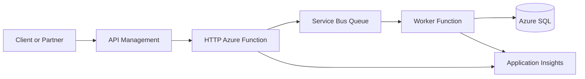
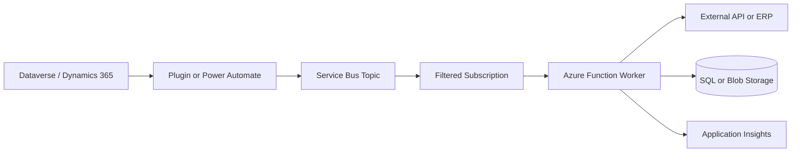
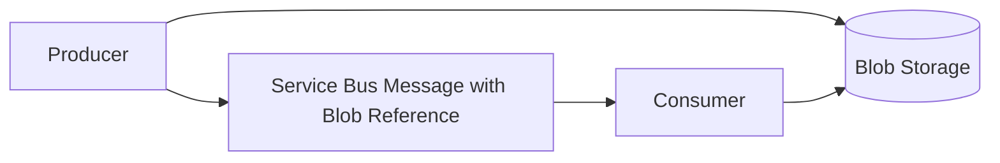
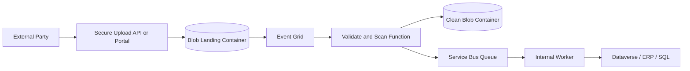
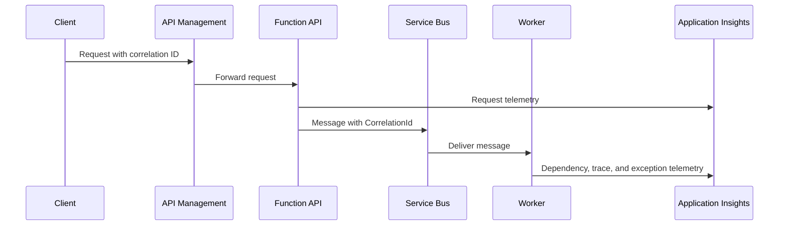
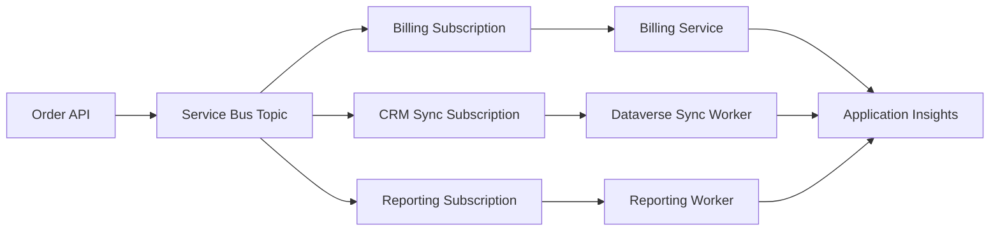
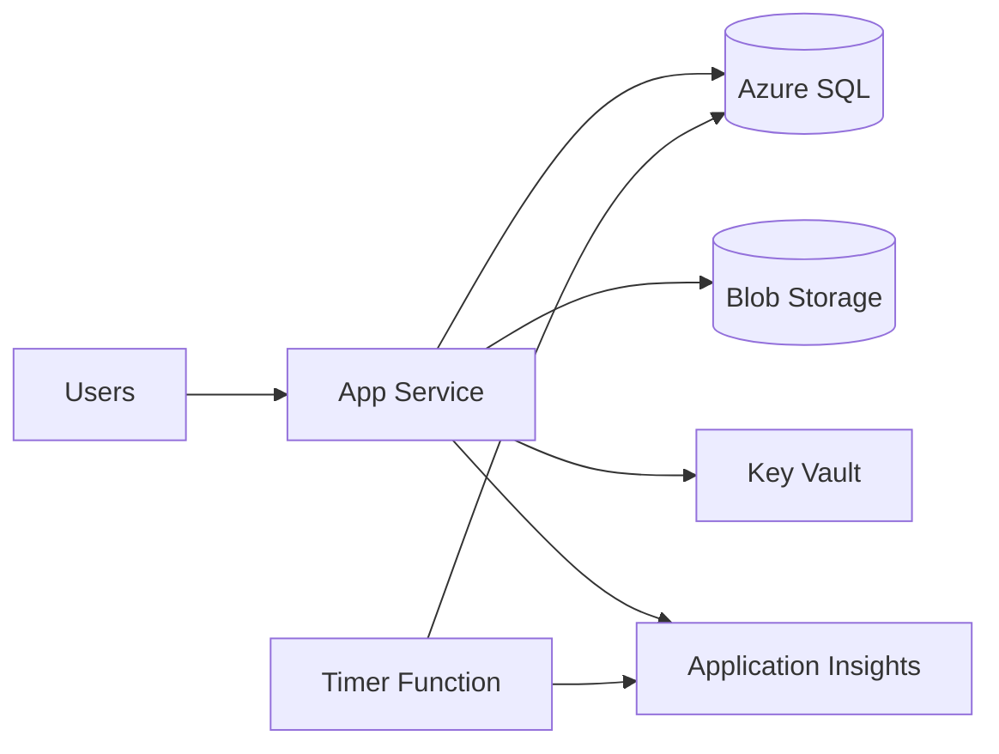
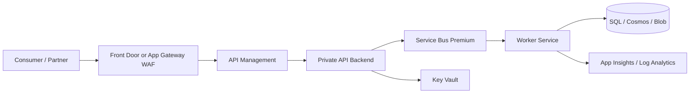

# Diagrams

Mermaid diagrams used by the Azure Services Cheat Sheet.

The diagrams stay in Markdown so they render directly in GitHub, remain easy to review in pull
requests, and can evolve with the written guidance.

## API Management To Functions To Service Bus To SQL

## Dataverse Integration Via Service Bus

## Blob Claim-Check Pattern

## DMZ-Safe Document Upload Architecture

## Monitoring And Distributed Tracing Flow

## Event-Driven Microservice Architecture

## Low-Cost Azure App Architecture

## Enterprise Secure Integration Architecture

