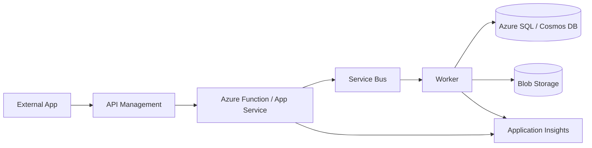
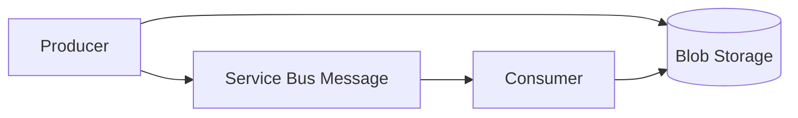
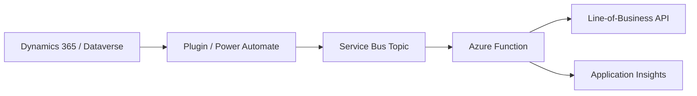

# Diagrams

This folder holds architecture diagrams used by the cheat sheet. Mermaid is preferred because it renders directly in GitHub markdown and stays reviewable in pull requests.

## Enterprise Integration

## Claim Check

## Dataverse Integration

