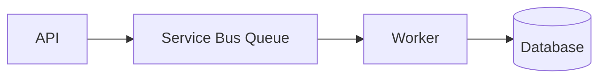
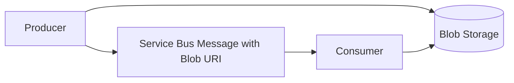
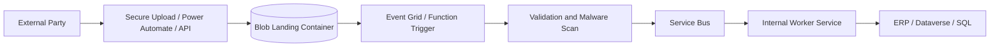

# Architecture Patterns

## What It Is

Reusable patterns for building Azure systems that are resilient, observable, secure, and practical to operate.

## Queue-Based Load Leveling

Use a queue between producers and workers to absorb bursts and protect downstream systems.

- Use when writes arrive faster than downstream systems can process.
- Avoid when callers need immediate synchronous completion.
- Watch queue length, age of oldest message, retries, and DLQ count.

## Event-Driven Architecture

Publish facts that something happened and let subscribers react independently.

- Use Event Grid for notification.
- Use Service Bus topics for business events requiring durable processing.
- Use Event Hubs for telemetry streams.

## API Gateway Pattern

Put API Management in front of backend APIs to centralize auth, policy, throttling, versioning, and partner access.

- Validate JWTs at the edge.
- Apply quotas and rate limits per consumer.
- Keep backend APIs private where possible.

## Retry And Circuit Breaker

Retries handle transient faults. Circuit breakers stop repeated calls to a failing dependency.

- Use exponential backoff and jitter.
- Do not retry non-transient validation errors.
- Keep retry budgets small inside HTTP request paths.

## Outbox Pattern

Write business data and message intent in the same database transaction, then publish messages asynchronously.

- Use when database changes and messages must not drift.
- Include idempotency keys.
- Monitor unpublished outbox rows.

## Claim Check Pattern

Store large payloads in Blob Storage and send a small reference message through Service Bus.

- Use for documents, large JSON payloads, images, and external file drops.
- Secure the blob with RBAC, private endpoints, or short-lived SAS.
- Delete or lifecycle old payloads.

## DMZ-Safe Document Ingestion

Accept documents into a controlled landing zone before internal processing.

- Use Blob Storage as the controlled handoff point.
- Use Functions, Power Automate, or worker services depending on complexity.
- Validate file type, size, schema, and source.
- Keep internal systems isolated from direct external upload paths.

## Common Gotchas

- Patterns add value only when they solve an actual constraint.
- Every async boundary needs correlation IDs and operational visibility.
- Idempotency is mandatory when retries and message redelivery exist.
- Poison messages are normal; design DLQ handling from day one.

## Security Notes

- Secure every hop, not just the entry point.
- Prefer Managed Identity and private access.
- Avoid sensitive data in messages and logs.

## Cost Considerations

- Queues and storage are cheap, but retries and logs can become noisy.
- API gateways and private networking introduce fixed costs.
- Extra reliability components need operational ownership.

## Official Docs

- [Azure Architecture Center](https://learn.microsoft.com/azure/architecture/)
- [Cloud Design Patterns](https://learn.microsoft.com/azure/architecture/patterns/)
