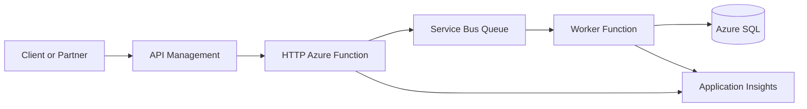
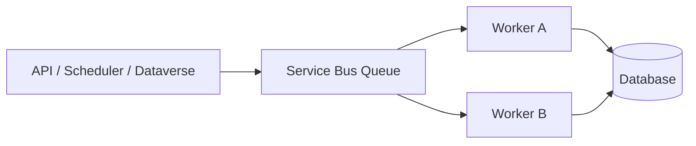
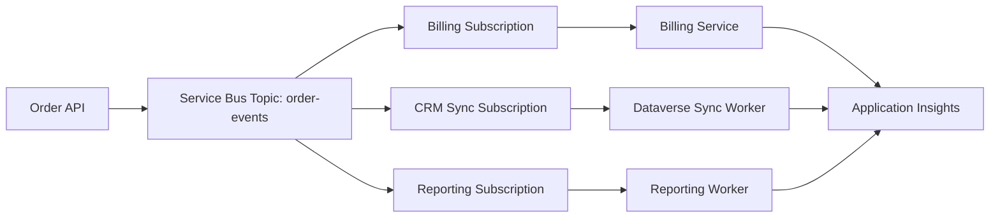
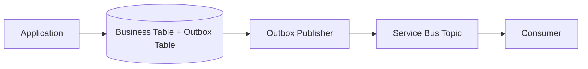
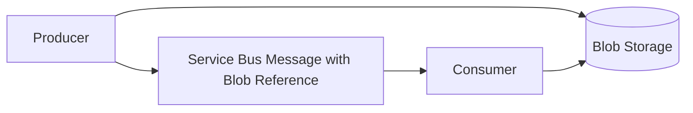
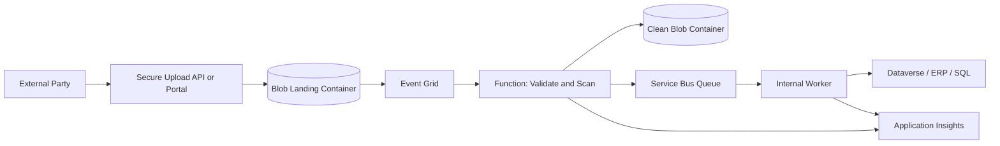
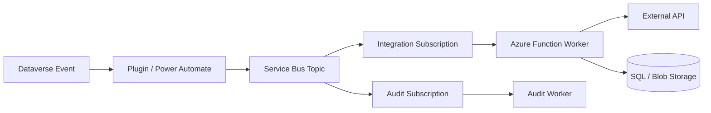
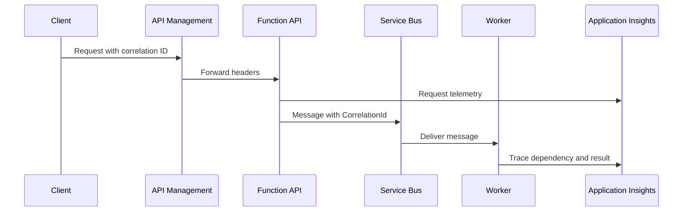

# Architecture Patterns

## What It Is

Reusable Azure patterns for building systems that are resilient, observable,
secure, and practical to operate.

These patterns are not academic. They are the shapes that show up in APIs,
Dataverse integrations, document ingestion, background processing, and
enterprise application integration.

## Pattern Summary

| Pattern | Use when | Core services |
| --- | --- | --- |
| Queue-based load leveling | Producers are burstier than consumers. | Service Bus, Functions. |
| API gateway | APIs need a managed boundary. | API Management. |
| Outbox | Database changes and messages must not drift. | Azure SQL, Service Bus. |
| Claim check | Payloads are too large for messages. | Blob Storage, Service Bus. |
| DMZ-safe ingestion | External files need controlled processing. | Blob, Event Grid, Functions. |
| Distributed tracing | Work crosses APIs, queues, and workers. | App Insights, Log Analytics. |
| Event-driven services | Services react independently to events. | Service Bus Topics. |

## Production Lessons Learned

- Async architecture without correlation IDs becomes hard to support quickly.
- Queue boundaries improve resilience only when DLQs, replay, and idempotency
  are designed.
- Private endpoints improve security, but DNS ownership becomes critical.
- Event-driven systems need schema versioning before the second consumer
  arrives.
- Diagrams should include monitoring and support paths, not only happy-path data
  flow.
- A pattern is not done until the failure path is designed.
- The support runbook is part of the architecture, not an afterthought.

## Anti-Patterns To Avoid

- "Everything calls everything" synchronous integration.
- Business-critical queues with no DLQ alert.
- Large documents embedded directly into messages.
- API gateways used to hide unstable backend contracts.
- One shared managed identity or connection string for every component.
- Production workflows that can only be understood from the portal.

## API Management To Functions To Service Bus

Use this when an external or internal API needs a clean contract but the actual
work should happen asynchronously.

### Why It Works

- API Management owns auth, policy, throttling, and versioning.
- The HTTP Function validates and accepts the request quickly.
- Service Bus absorbs bursts and protects downstream systems.
- Workers can scale independently and retry safely.
- Application Insights ties the request, message, and worker together.

### Watch For

- The API should return `202 Accepted` when processing is async.
- The worker must be idempotent.
- The queue needs DLQ monitoring and replay procedures.
- Correlation IDs must be copied into message properties.

## Queue-Based Load Leveling

Use a queue between producers and workers to absorb spikes.

### Queue Leveling Use Cases

- Incoming requests arrive in bursts.
- Downstream systems have rate limits.
- Work can complete asynchronously.
- You need controlled retries and DLQ handling.

### Avoid When

- The caller needs immediate completion.
- Ordering must be global across all messages.
- The team cannot operate queues and DLQs.

## Event-Driven Microservice Architecture

Use this when multiple services need to react to business events without tight
coupling.

### Production Lessons

- Version event schemas.
- Keep events small and stable.
- Give every subscription an owner.
- Monitor each subscription independently.
- Design consumers for duplicate delivery.

## API Gateway Pattern

Put API Management in front of backend APIs to centralize cross-cutting
concerns.

### Good Uses

- Partner or multi-team API exposure.
- JWT validation and authorization checks.
- Rate limiting, quotas, and subscription keys.
- Request/response transformation.
- API versioning and developer documentation.

### Poor Uses

- Hiding an unstable backend instead of fixing it.
- Implementing complex business logic in policies.
- Replacing application authorization entirely.

## Retry And Circuit Breaker

Retries handle transient faults. Circuit breakers stop repeated calls to a
dependency that is already failing.

### Good Defaults

- Use exponential backoff with jitter.
- Retry only known transient failures.
- Keep HTTP request-path retries short.
- Move long retry workflows behind a queue.
- Log retry reason, attempt number, and dependency name.

### Avoid

- Retrying validation errors.
- Infinite retries.
- Synchronized retries from many workers.
- Retrying Dataverse or partner APIs without respecting rate limits.

## Outbox Pattern

Use an outbox when a database write and message publish must stay consistent.

### Use When

- A business transaction must lead to a message.
- Losing the message would create data drift.
- Publishing directly inside the request path is unreliable.

### Outbox Watch Points

- The outbox publisher needs idempotency.
- Old published rows need cleanup.
- Consumers still need duplicate handling.
- Monitoring should alert on unpublished outbox age.

## Claim Check Pattern

Use Blob Storage for large or sensitive payloads and send a reference through
Service Bus.

### Claim Check Use Cases

- Payloads exceed message size limits.
- Payloads are documents, images, exports, or large JSON.
- Consumers need controlled access to the payload.
- Payload retention differs from message retention.

### Claim Check Watch Points

- Blob permissions must be scoped carefully.
- Lifecycle rules should clean up old payloads.
- Consumers need clear behavior when the blob is missing.
- Avoid long-lived SAS tokens when Managed Identity can be used.

## DMZ-Safe Document Ingestion

Use a controlled landing zone for externally supplied files before they reach
internal systems.

### DMZ Ingestion Use Cases

- External parties upload documents.
- Files need validation, scanning, or classification.
- Internal systems should not be directly exposed.
- Processing needs replay and auditability.

### DMZ Ingestion Watch Points

- Validate file type, size, metadata, and schema.
- Isolate landing and clean containers.
- Apply retention and legal hold rules where needed.
- Record audit events for upload, validation, rejection, and processing.

## Dataverse Integration Via Service Bus

Use Service Bus to decouple Dataverse from downstream systems.

### Dataverse Production Lessons

- Keep Dataverse plug-ins fast.
- Publish minimal messages with stable IDs.
- Use application users and least-privilege security roles.
- Handle Dataverse throttling with bounded backoff.
- Log Dataverse table, row ID, operation, and correlation ID.

## Monitoring And Distributed Tracing

Use a shared correlation ID across the whole flow.

### Good Signals

- API request failure rate.
- Dependency failure rate.
- Queue length and message age.
- DLQ count.
- Processing duration.
- Correlated exceptions by business key.

## Security Notes

- Prefer Managed Identity across Azure services.
- Use private endpoints for sensitive data stores and queues.
- Validate JWTs at API Management and authorize in the application.
- Avoid sensitive data in messages, logs, and workflow run history.
- Separate runtime identities from deployment identities.

## Cost Notes

- Queues and blobs are cheap until retries, logging, and retention get noisy.
- API Management, private networking, and Premium plans add baseline cost.
- Over-instrumentation can make Log Analytics expensive.
- Async designs can reduce peak compute cost by smoothing workloads.

## What I Would Choose In 2026

| Problem                                           | Pattern                                   |
| ------------------------------------------------- | ----------------------------------------- |
| Slow downstream processing from an API            | API Management to Function to Service Bus |
| Dataverse integration that should not block users | Dataverse to Service Bus Topic            |
| Large document or JSON payloads                   | Blob claim check                          |
| External document upload                          | DMZ-safe document ingestion               |
| Multi-consumer business events                    | Service Bus Topic per business event      |
| Consistent database write and publish             | Outbox pattern                            |

## Official Docs

- [Azure Architecture Center](https://learn.microsoft.com/azure/architecture/)
- [Cloud Design Patterns](https://learn.microsoft.com/azure/architecture/patterns/)
