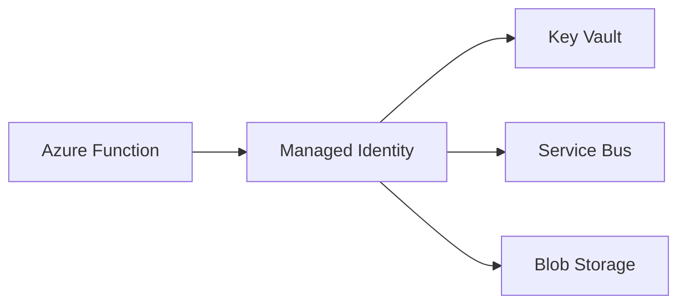

# Identity & Security

## What It Is

Azure identity and security services control who can access resources, how workloads authenticate,
how secrets are stored, and how private enterprise traffic reaches cloud services.

| Service            | Best fit                                                        |
| ------------------ | --------------------------------------------------------------- |
| Microsoft Entra ID | Users, groups, app registrations, OAuth 2.0, workload identity. |
| Managed Identity   | Passwordless auth from Azure workloads to Azure resources.      |
| Key Vault          | Secrets, certificates, and cryptographic keys.                  |
| Azure RBAC         | Resource-level authorization.                                   |
| Private Endpoint   | Private network access to Azure PaaS services.                  |
| App Configuration  | Non-secret configuration and feature flags.                     |

## Key Vault Vs App Configuration

| Question                    | Key Vault                    | App Configuration            |
| --------------------------- | ---------------------------- | ---------------------------- |
| Stores secrets              | Yes                          | No                           |
| Stores certificates         | Yes                          | No                           |
| Stores feature flags        | No                           | Yes                          |
| Handles non-secret settings | Possible, but not ideal      | Strong fit                   |
| Common access pattern       | Secure secret retrieval      | Centralized config read      |
| Typical pairing             | Source for secret references | References Key Vault secrets |

## When To Use It

- Use Managed Identity for Azure-to-Azure authentication.
- Use Key Vault for secrets, certificates, signing keys, and rotation workflows.
- Use Entra app registrations for OAuth clients and APIs.
- Use Azure RBAC for least-privilege access to Azure resources.
- Use Private Endpoints when traffic must stay on private IP space.
- Use App Configuration for non-secret environment configuration and feature flags.

## When Not To Use It

- Do not use client secrets where Managed Identity is available.
- Do not assign broad roles such as Owner or Contributor to app identities.
- Do not store secrets in source control, pipeline YAML, appsettings, or plain Dataverse
  configuration.
- Do not create private endpoints without DNS ownership.
- Do not treat API Management JWT validation as a replacement for application authorization.

## Security Mistakes To Avoid

- Reusing one app registration across unrelated integrations.
- Storing Service Bus connection strings in appsettings instead of using Managed Identity.
- Granting Contributor to runtime workloads because a narrower data-plane role was not looked up.
- Creating private endpoints without testing DNS from apps and deployment agents.
- Logging tokens, SAS URLs, message bodies, or Key Vault secret values.

## OAuth 2.0 And App Registration Notes

| Scenario                         | Typical approach                                             |
| -------------------------------- | ------------------------------------------------------------ |
| User-facing web app              | Authorization code flow with PKCE.                           |
| Service-to-service outside Azure | Client credentials with certificate where possible.          |
| Azure-hosted service-to-service  | Managed Identity.                                            |
| API exposed to partners          | App registration exposing scopes or app roles.               |
| Background daemon                | Client credentials or Managed Identity depending on hosting. |

## Managed Identity Patterns



### Good Uses

- Function reads Key Vault secrets.
- Worker sends and receives Service Bus messages.
- App Service reads Blob Storage.
- Deployment pipeline assigns RBAC to runtime identities.

### Watch For

- System-assigned identities have different object IDs per environment.
- User-assigned identities are easier to reuse across replacements.
- RBAC propagation is not instant.
- Local development needs `DefaultAzureCredential` configuration.

## Least Privilege Checklist

- Assign roles at the narrowest practical scope.
- Separate runtime identities from deployment identities.
- Use sender-only and receiver-only Service Bus roles where possible.
- Grant Key Vault Secrets User instead of Key Vault Administrator for apps.
- Review app registration API permissions and admin consent.
- Rotate credentials that cannot be replaced with Managed Identity.
- Alert on privileged role assignment changes.
- Remove unused app registrations and expired credentials.

## Private Endpoint Checklist

- Create private DNS zones before cutting over production traffic.
- Confirm name resolution from build agents, apps, and support machines.
- Disable public network access only after private connectivity is validated.
- Document break-glass access for support.
- Monitor DNS changes and network security rules.

## Security Considerations

- Use OAuth 2.0 and Entra ID for APIs.
- Validate tokens at API Management and authorize in the application.
- Use Key Vault references or SDK access instead of copied secrets.
- Avoid logging tokens, connection strings, message bodies, and document contents.
- Enable diagnostic logs for Key Vault, API Management, Service Bus, and identity-sensitive
  resources.
- Use conditional access and privileged identity management for human access.

## Cost Considerations

- Entra ID capability depends on tenant licensing.
- Key Vault charges for operations and protected key usage.
- Private Endpoints add hourly and data processing charges.
- Security and audit logs can materially increase Log Analytics cost.
- Overuse of separate vaults can increase management overhead.

## Operational Gotchas

- Key Vault firewall rules often break pipelines and local debugging.
- Private Endpoint DNS issues can look like application outages.
- App registration secrets expire silently unless monitored.
- RBAC changes can take minutes to become effective.
- Copying secrets into app settings creates rotation debt.

## Production Lessons Learned

- Managed Identity removes secret rotation work, but RBAC still needs ownership.
- System-assigned identities are easy until a resource is replaced and the object ID changes.
- Key Vault is not a substitute for configuration design; store only secrets there.
- Private networking is a platform feature, not an application afterthought.
- Every privileged role assignment should have a reason and an owner.

## What I Would Choose In 2026

| Scenario                              | Choice                                |
| ------------------------------------- | ------------------------------------- |
| Azure workload to Azure resource      | Managed Identity                      |
| Secret storage                        | Key Vault with RBAC                   |
| Feature flags and non-secret settings | App Configuration                     |
| Partner API auth                      | Entra app registration with OAuth 2.0 |
| Internal PaaS connectivity            | Private Endpoint where justified      |

## .NET Key Vault With Managed Identity

```csharp
using Azure.Identity;
using Azure.Security.KeyVault.Secrets;

var client = new SecretClient(
    new Uri("https://kv-contoso-prod.vault.azure.net/"),
    new DefaultAzureCredential());

KeyVaultSecret secret = await client.GetSecretAsync("ServiceBus--Namespace");
Console.WriteLine($"Loaded secret '{secret.Name}'");
```

## Official Docs

- [Microsoft identity platform documentation](https://learn.microsoft.com/entra/identity-platform/)
- [Managed identities documentation](https://learn.microsoft.com/entra/identity/managed-identities-azure-resources/)
- [Azure Key Vault documentation](https://learn.microsoft.com/azure/key-vault/)
- [Azure RBAC documentation](https://learn.microsoft.com/azure/role-based-access-control/)
- [Private Endpoint documentation](https://learn.microsoft.com/azure/private-link/private-endpoint-overview)
