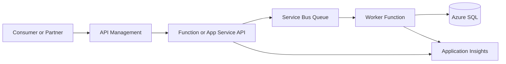
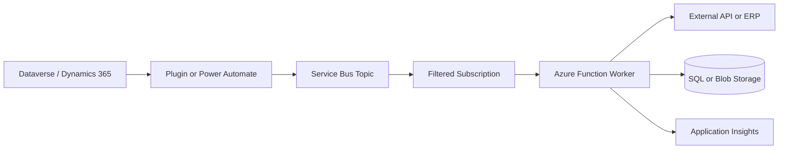

# Integration

## What It Is

Azure integration services connect applications, APIs, workflows, events, messages, files, and
enterprise systems. In real projects this usually means a mix of API Management, Azure Functions,
Logic Apps, Service Bus, Event Grid, Blob Storage, Key Vault, and monitoring.

| Service             | Best fit                                                            |
| ------------------- | ------------------------------------------------------------------- |
| API Management      | API gateway, policy, throttling, JWT validation, partner contracts. |
| Azure Functions     | Code-first integration logic, event handlers, queue processors.     |
| Logic Apps          | Workflow automation, connectors, approvals, low-code orchestration. |
| Durable Functions   | Code-first stateful orchestration and fan-out/fan-in.               |
| Event Grid          | Event notification and reactive routing.                            |
| Integration Account | B2B schemas, maps, certificates, partners, and agreements.          |

## Logic Apps Vs Durable Functions

| Question                    | Logic Apps                           | Durable Functions                           |
| --------------------------- | ------------------------------------ | ------------------------------------------- |
| Best for                    | Connector-heavy workflows            | Code-first orchestration                    |
| Developer model             | Designer and workflow JSON           | .NET, JavaScript, Python code               |
| Visibility                  | Strong run history                   | App Insights and orchestration history      |
| Complex domain logic        | Usually awkward                      | Better fit                                  |
| Long-running workflow       | Yes                                  | Yes                                         |
| Source control diff quality | Mixed                                | Stronger                                    |
| Testing                     | Harder                               | Easier with normal code practices           |
| Typical use                 | SaaS integration, approvals, routing | Fan-out/fan-in, sagas, custom orchestration |

## Functions Vs App Service Vs Container Apps

| Need                   | Functions             | App Service          | Container Apps           |
| ---------------------- | --------------------- | -------------------- | ------------------------ |
| HTTP API               | Good for small APIs   | Strong default       | Good when containerized  |
| Queue processor        | Strong default        | Possible with worker | Strong with KEDA scaling |
| Long-running process   | Use Premium carefully | Good                 | Good                     |
| Custom container       | Supported             | Supported            | Native fit               |
| Scale to zero          | Consumption plans     | No                   | Yes                      |
| Operational simplicity | High                  | High                 | Medium                   |

## When To Use Integration Services

- Use API Management when APIs need a managed boundary.
- Use Functions when the integration needs custom code and testability.
- Use Logic Apps when connectors, workflow history, and orchestration speed matter.
- Use Durable Functions when orchestration logic belongs in code.
- Use Event Grid when a resource event should trigger downstream work.
- Use Service Bus when work must be processed reliably and asynchronously.

## When Not To Use Them

- Do not put complex domain logic into Logic Apps just because a connector is available.
- Do not expose raw Function URLs to external consumers when policies, throttling, versioning, and
  auth normalization are needed.
- Do not use Event Grid as a business command queue.
- Do not use Durable Functions for simple queue consumers.
- Do not build point-to-point integrations without ownership, retries, monitoring, and replay
  thinking.

## What Breaks First In Production

- Point-to-point integrations fail without a replay path.
- API Management policies mask backend errors because diagnostics are thin.
- Logic Apps become hard to review when business logic grows inside workflow definitions.
- Dataverse plug-ins call slow external APIs and degrade user transactions.
- Correlation IDs are lost between API, workflow, queue, and worker.

## Typical Enterprise API Flow

## Dataverse / Dynamics 365 Integration

Dataverse integrations should protect transaction performance and respect service protection limits.
Push slow or unreliable downstream work out of the Dataverse request path.

### Practical Dataverse Notes

- Keep synchronous plug-ins short.
- Prefer async plug-ins, webhooks, Service Bus, or Power Automate for long work.
- Use application users with least-privilege security roles.
- Include `CorrelationId`, table name, row ID, and operation in messages.
- Handle Dataverse throttling with backoff and bounded retries.
- Avoid writing integration secrets into Dataverse configuration tables.

## Hybrid Integration Patterns

| Pattern                                  | Use when                                      | Watch for                           |
| ---------------------------------------- | --------------------------------------------- | ----------------------------------- |
| API Management to private backend        | Internal APIs need controlled external access | DNS, certificates, private routing  |
| Logic Apps with on-premises data gateway | Workflow needs legacy/on-premises connectors  | Gateway ownership and throughput    |
| Service Bus relay or queue handoff       | Internal system should pull work securely     | Message schema and replay process   |
| Self-hosted deployment agent             | CI/CD must deploy into a private network      | Agent patching and credential scope |
| Blob landing zone                        | External party uploads documents              | Malware scan, validation, lifecycle |

## Security Considerations

- Validate OAuth 2.0 JWTs in API Management.
- Prefer Managed Identity between Azure services.
- Store secrets and certificates in Key Vault.
- Use private endpoints for sensitive backends.
- Restrict Logic App callback URLs and rotate them when exposed.
- Separate partner-facing APIs from internal management APIs.

## Scaling Considerations

- Scale APIs and workers independently by using queues.
- Use Service Bus queue length and message age as worker scaling signals.
- Use Functions Premium or Container Apps for predictable cold-start behavior.
- Protect Dataverse and downstream APIs with throttling and backoff.
- Avoid chatty per-record calls when batch APIs are available.

## Common Scaling Traps

- Scaling Functions without checking downstream API limits.
- Using Logic Apps for high-volume transformation-heavy workloads that belong in code.
- Letting Power Automate or Logic Apps trigger one flow run per record in a bulk import.
- Using synchronous HTTP chains where a queue boundary would absorb spikes.

## Cost Considerations

- API Management has a tier-based baseline cost.
- Logic Apps cost can grow with high-volume connector actions.
- Functions cost depends on plan, duration, memory, and execution count.
- Durable Functions stores orchestration state and history.
- Private networking and diagnostic logs can be material in enterprise setups.

## Common Cost Traps

- API Management tier chosen for production but left running for unused test environments.
- Logic App action count grows because loops process records one by one.
- Verbose workflow run history captures large payloads.
- Private endpoints and DNS zones are created broadly without ownership.

## Operational Gotchas

- API Management policies can hide backend failure details without diagnostics.
- Logic App run history may contain sensitive data unless inputs/outputs are secured.
- Durable Function orchestrators must be deterministic.
- Event Grid retries do not make it a command queue.
- Lack of correlation IDs makes cross-service incidents painful.

## Anti-Patterns

- Synchronous plug-in to external API for non-critical downstream work.
- One giant Logic App that owns every business process branch.
- API Management policies containing business logic that should be in code.
- Service Bus messages with unclear schema ownership.
- No replay path for failed integration messages.

## What I Would Choose In 2026

| Scenario                              | Choice                                           |
| ------------------------------------- | ------------------------------------------------ |
| Public enterprise API boundary        | API Management                                   |
| Code-heavy integration handler        | Azure Functions or App Service                   |
| Connector-heavy workflow              | Logic Apps                                       |
| Long-running code-first orchestration | Durable Functions                                |
| Reliable async handoff                | Service Bus                                      |
| Dataverse-to-Azure decoupling         | Service Bus Topic plus Azure Function subscriber |

## Production Checklist

- Define API contracts and versioning rules.
- Validate auth at the edge.
- Use queue boundaries for slow or unreliable downstream systems.
- Capture correlation IDs from API to message to worker.
- Monitor API failures, queue age, DLQs, dependency failures, and retry rates.
- Document replay and support procedures.

## Official Docs

- [Azure Integration Services documentation](https://learn.microsoft.com/azure/logic-apps/logic-apps-overview)
- [API Management documentation](https://learn.microsoft.com/azure/api-management/)
- [Azure Functions documentation](https://learn.microsoft.com/azure/azure-functions/)
- [Durable Functions documentation](https://learn.microsoft.com/azure/azure-functions/durable/)
- [Dataverse developer documentation](https://learn.microsoft.com/power-apps/developer/data-platform/)
