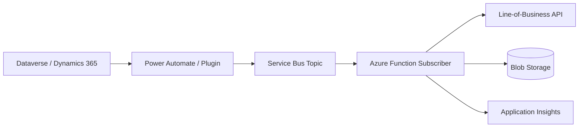

# Integration

## What It Is

Azure integration services connect systems safely and reliably: APIs, workflows, event routing, serverless code, B2B artifacts, hybrid connectivity, and enterprise application integration.

| Service | Best fit |
| --- | --- |
| Logic Apps | Workflow automation, connectors, approvals, enterprise integration. |
| Azure Functions | Custom code, transformations, handlers, API logic, queue processors. |
| API Management | API gateway, policies, throttling, auth mediation, developer portal. |
| Event Grid | Event notification and reactive routing. |
| Durable Functions | Stateful orchestration in code. |
| Integration Account | B2B artifacts such as schemas, maps, certificates, partners, agreements. |

## When To Use It

- Use Logic Apps when connectors and workflow visibility matter.
- Use Functions when custom code, unit tests, or performance-sensitive handlers matter.
- Use API Management in front of internal APIs exposed to other teams or partners.
- Use Event Grid for lightweight event notification between services.
- Use Durable Functions for orchestrations that need code-first control.
- Use hybrid patterns for on-premises systems, private APIs, or legacy integration.

## When Not To Use It

- Do not use Logic Apps for complex domain logic that belongs in code.
- Do not use Event Grid for business commands that require guaranteed ordered processing.
- Do not expose Functions directly to partners when you need policies, quotas, auth normalization, or versioning.
- Do not overuse Durable Functions for simple queue consumers.

## Common Patterns

- API Management to Function or App Service, with Managed Identity to downstream services.
- Logic App receives a Dataverse event, enriches data, and posts to Service Bus.
- Event Grid triggers a Function when a blob is uploaded.
- Durable Functions fan-out/fan-in for long-running integration steps.
- Hybrid integration using VPN/ExpressRoute, private endpoints, on-premises data gateway, or self-hosted agents.
- Dataverse plug-in or Power Automate publishes to Service Bus for Azure-side processing.



## Dynamics 365 / Dataverse Considerations

- Respect Dataverse service protection limits and design for retry/backoff.
- Use Service Bus or webhooks to decouple Dataverse transactions from downstream processing.
- Keep plug-ins short; push long-running work to queues or async services.
- Use application users and least-privilege security roles for integrations.
- Avoid storing secrets in Dataverse custom settings; use Key Vault or secure environment variables.
- Include correlation IDs across Dataverse, Azure Functions, Service Bus, and Application Insights.

## Common Gotchas

- Logic App connector limits and licensing can affect throughput and cost.
- API Management policies can hide backend errors if diagnostics are weak.
- Event Grid retries for delivery but is not a command queue.
- Durable Functions orchestration code must be deterministic.
- Dataverse callbacks can fail under service protection throttling if retries are aggressive.

## Security Notes

- Prefer OAuth 2.0 and Entra ID over shared keys.
- Use Managed Identity between Azure resources.
- Validate JWTs at API Management.
- Use private endpoints for sensitive APIs and storage.
- Restrict Logic App trigger URLs and rotate callback URLs if exposed.

## Cost Considerations

- Logic Apps can be very cost-effective until high-volume connector usage grows.
- API Management has a fixed baseline cost by tier.
- Functions cost depends on plan, executions, memory, and duration.
- Durable Functions stores orchestration state and history.

## Examples

```bash
az apim create \
  --name apim-cheatsheet-dev \
  --resource-group rg-cheatsheet-dev \
  --publisher-email platform@example.com \
  --publisher-name Platform \
  --sku-name Developer
```

```csharp
[Function("HttpToQueue")]
public async Task<HttpResponseData> Run(
    [HttpTrigger(AuthorizationLevel.Function, "post")] HttpRequestData req)
{
    var body = await new StreamReader(req.Body).ReadToEndAsync();
    await sender.SendMessageAsync(new ServiceBusMessage(body));
    return req.CreateResponse(HttpStatusCode.Accepted);
}
```

## Official Docs

- [Azure Integration Services documentation](https://learn.microsoft.com/azure/logic-apps/logic-apps-overview)
- [API Management documentation](https://learn.microsoft.com/azure/api-management/)
- [Event Grid documentation](https://learn.microsoft.com/azure/event-grid/)
- [Durable Functions documentation](https://learn.microsoft.com/azure/azure-functions/durable/)
- [Dataverse developer documentation](https://learn.microsoft.com/power-apps/developer/data-platform/)
