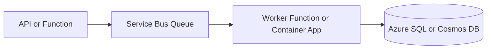
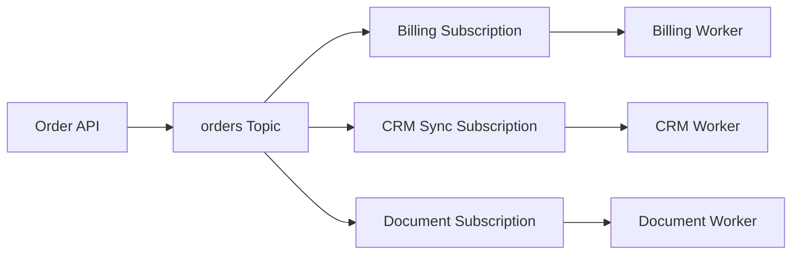
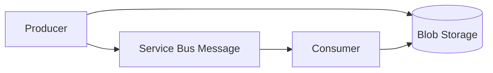

# Messaging

## What It Is

Azure messaging services move work between systems without tight runtime
coupling. They are the backbone of reliable integration, event-driven design,
and workload smoothing.

| Service           | Best fit                                                            |
| ----------------- | ------------------------------------------------------------------- |
| Service Bus Queue | Durable commands, background work, retries, dead-letter handling.   |
| Service Bus Topic | Durable business pub/sub with subscriptions and filters.            |
| Event Grid        | Lightweight event notification and reactive routing.                |
| Event Hubs        | High-volume telemetry, logs, clickstreams, and streaming ingestion. |
| Storage Queue     | Simple queueing with a smaller feature set.                         |

## Service Bus Vs Event Grid Vs Event Hubs

| Question | Service Bus | Event Grid | Event Hubs |
| --- | --- | --- | --- |
| Primary use | Business messaging | Event notification | Streaming ingestion |
| Delivery model | Pull/process | Push delivery | Partitioned stream |
| Durability | Strong | Retried delivery | Retention window |
| Ordering | Sessions | Not guaranteed | Per partition |
| Dead-lettering | Built in | Endpoint option | Consumer-managed |
| Typical payload | Command/event | Small envelope | Telemetry event |
| Dataverse fit | Strong | Sometimes | Rare |
| Telemetry fit | Sometimes | No | Strong |

## When To Use Service Bus

- You need reliable business message processing.
- Producers and consumers should not depend on each other being online.
- Messages may need retries, dead-letter queues, duplicate detection, or
  sessions.
- Multiple consumers need independent subscriptions to the same business event.
- You are decoupling Dataverse, Dynamics 365, APIs, workers, or third-party
  systems.

## When Not To Use Service Bus

- You only need to notify subscribers that a blob or resource changed.
- You are ingesting very high-volume telemetry streams.
- You need real-time request/response.
- You need long-term event replay across large streams.
- The team has no operational plan for DLQs, retries, and poison messages.

## What Breaks First In Production

- DLQs grow quietly because nobody owns the alert or replay process.
- Consumers process messages in parallel and accidentally break ordering
  assumptions.
- Lock duration is shorter than real processing time, causing duplicate work.
- Retry policies hammer a throttled downstream API instead of backing off.
- Message schemas change without versioning and older consumers fail.

If message ordering matters, avoid unrestricted parallel consumers unless using
sessions or a separate ordering strategy. Teams often discover this only after
reconciliation or downstream processing issues appear in production.

## Core Concepts

| Concept             | Practical meaning                                                          |
| ------------------- | -------------------------------------------------------------------------- |
| Queue               | One logical backlog processed by one or more competing consumers.          |
| Topic               | One published message copied to matching subscriptions.                    |
| Subscription        | A durable subscriber with independent delivery state.                      |
| Dead-letter queue   | Holding area for poison, expired, or explicitly rejected messages.         |
| Lock                | A temporary processing lease that must complete or renew before expiry.    |
| Duplicate detection | Suppresses messages with the same `MessageId` in a configured time window. |
| Session             | Groups related messages for ordered, single-consumer processing.           |

## Common Patterns

### Queue-Based Load Leveling

Use a queue between an API and worker to absorb bursts.



### Topic Per Business Event

Publish domain events once and let each subscriber own its own processing.



### Claim Check

Store large payloads in Blob Storage and send a pointer through Service Bus.



## Scaling Considerations

- Increase consumer concurrency only after handlers are idempotent.
- Use sessions only when ordering is required; they reduce parallelism.
- Use Premium when predictable throughput and resource isolation matter.
- Keep message handlers short and move slow downstream calls behind their own
  queues when needed.
- Watch queue length, active messages, scheduled messages, lock lost count, and
  age of oldest message.

## Common Scaling Traps

- Increasing `MaxConcurrentCalls` before the database or downstream API can
  handle the load.
- Using sessions for every message and then wondering why throughput is low.
- Treating Service Bus as a streaming platform instead of using Event Hubs.
- Publishing large payloads instead of using Blob Storage claim check.
- Allowing one subscription to become a forgotten backlog.

## Security Considerations

- Prefer Managed Identity and Azure RBAC over connection strings.
- Use separate roles for senders and receivers.
- Scope access at the queue or topic level where practical.
- Use private endpoints for internal enterprise messaging.
- Do not log full message bodies if they can contain personal, financial, or
  commercially sensitive data.

## Cost Considerations

- Standard is cost-effective for many business workloads.
- Premium has a fixed baseline cost but better isolation and predictable
  throughput.
- High retry rates can increase operations and hide downstream failures.
- DLQ buildup is both an operational risk and a storage cost smell.
- Event Hubs pricing is usually better for high-volume telemetry than Service
  Bus.

## Common Cost Traps

- Choosing Premium too early for a low-volume workload.
- Keeping verbose message body logs in Log Analytics.
- Creating many subscriptions without clear owners.
- Retrying poison messages repeatedly instead of dead-lettering them.
- Retaining claim-check blobs longer than the replay window requires.

## Operational Gotchas

- Message delivery is at-least-once. Design idempotent consumers.
- Lock duration must cover processing or be renewed.
- `MaxDeliveryCount` moves repeated failures to the DLQ.
- Duplicate detection only works when producers set stable `MessageId` values.
- Poison messages are normal; build replay and triage tooling.
- Correlation IDs must be copied into message application properties.

## Anti-Patterns

- Using Service Bus as a database.
- Using Event Grid for business commands that require ordered processing.
- Treating DLQ replay as a manual portal-only activity.
- Publishing internal database row dumps as integration contracts.
- Sharing one connection string across every producer and consumer.

## What I Would Choose In 2026

| Scenario                          | Choice                                             |
| --------------------------------- | -------------------------------------------------- |
| Business-critical async command   | Service Bus Queue                                  |
| Durable business pub/sub          | Service Bus Topic                                  |
| Lightweight resource notification | Event Grid                                         |
| High-volume telemetry stream      | Event Hubs                                         |
| Large payload workflow            | Blob Storage plus Service Bus claim check          |
| Ordered per-entity processing     | Service Bus sessions with clear concurrency limits |

## Production Checklist

- Define ownership for every queue, topic, and subscription.
- Set alerts for DLQ count and age of oldest active message.
- Use structured logging with `MessageId`, `CorrelationId`, and business keys.
- Include retry classification for transient, validation, and poison failures.
- Document replay steps and permissions before production.
- Test duplicate delivery before production.
- Decide whether ordering matters before increasing consumer concurrency.

## .NET Sender

```csharp
using Azure.Identity;
using Azure.Messaging.ServiceBus;

await using var client = new ServiceBusClient(
    "sbns-contoso-prod.servicebus.windows.net",
    new DefaultAzureCredential());

ServiceBusSender sender = client.CreateSender("orders");

var message = new ServiceBusMessage(BinaryData.FromObjectAsJson(new
{
    OrderId = "SO-10042",
    Source = "Dataverse",
    SubmittedOnUtc = DateTimeOffset.UtcNow
}))
{
    MessageId = "orders/SO-10042",
    Subject = "OrderSubmitted",
    CorrelationId = "corr-123"
};

message.ApplicationProperties["sourceSystem"] = "dataverse";
message.ApplicationProperties["schemaVersion"] = "1.0";

await sender.SendMessageAsync(message);
```

## .NET Receiver

```csharp
using Azure.Identity;
using Azure.Messaging.ServiceBus;
using Microsoft.Extensions.Logging;

ServiceBusClient client = new(
    "sbns-contoso-prod.servicebus.windows.net",
    new DefaultAzureCredential());

ServiceBusProcessor processor = client.CreateProcessor(
    "orders",
    new ServiceBusProcessorOptions
    {
        AutoCompleteMessages = false,
        MaxConcurrentCalls = 8
    });

processor.ProcessMessageAsync += async args =>
{
    string correlationId = args.Message.CorrelationId;
    string body = args.Message.Body.ToString();

    try
    {
        await ProcessOrderAsync(body, correlationId);
        await args.CompleteMessageAsync(args.Message);
    }
    catch (ValidationException ex)
    {
        await args.DeadLetterMessageAsync(
            args.Message,
            "ValidationFailed",
            ex.Message);
    }
    catch (Exception)
    {
        await args.AbandonMessageAsync(args.Message);
    }
};

processor.ProcessErrorAsync += args =>
{
    Console.Error.WriteLine(args.Exception);
    return Task.CompletedTask;
};

await processor.StartProcessingAsync();
```

## Official Docs

- [Azure Service Bus documentation](https://learn.microsoft.com/azure/service-bus-messaging/)
- [Queues, topics, subscriptions][service-bus-queues]
- [Event Grid documentation](https://learn.microsoft.com/azure/event-grid/)
- [Event Hubs documentation](https://learn.microsoft.com/azure/event-hubs/)

[service-bus-queues]: https://learn.microsoft.com/azure/service-bus-messaging/service-bus-queues-topics-subscriptions
