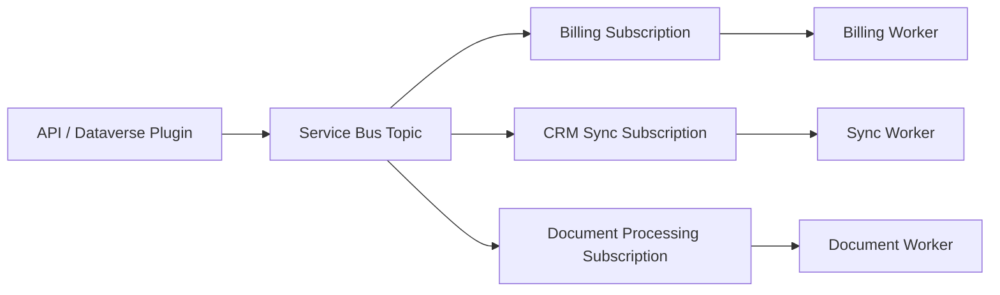

# Messaging

## What It Is

Azure messaging services move work between systems without tight runtime coupling.

| Service | Best fit |
| --- | --- |
| Service Bus Queues | Business commands, competing consumers, retries, dead-lettering. |
| Service Bus Topics | Pub/sub business messaging with subscriptions and filters. |
| Event Grid | Lightweight event notification. |
| Event Hubs | High-throughput telemetry and streaming ingestion. |
| Storage Queues | Simple, low-cost queueing with fewer enterprise features. |

## When To Use It

- Use Service Bus for commands, integration jobs, business events, and reliable async processing.
- Use topics and subscriptions when multiple consumers need independent processing.
- Use dead-letter queues for poison messages and operational triage.
- Use sessions when related messages must be processed in order.
- Use duplicate detection when upstream systems may resend the same business message.

## When Not To Use It

- Do not use Event Grid when consumers must process every business command exactly once.
- Do not use Event Hubs for request/reply or command processing.
- Do not use Service Bus sessions casually; they constrain concurrency.
- Do not put large payloads directly into messages; use Blob Storage and send a reference.

## Service Comparison

| Need | Pick | Why |
| --- | --- | --- |
| Guaranteed business message processing | Service Bus | Queues, topics, retries, DLQ, transactions, sessions. |
| Notify subscribers that something happened | Event Grid | Event routing, filtering, push delivery. |
| Ingest millions of telemetry events | Event Hubs | Partitioned streaming and high throughput. |
| Simple low-cost queue | Storage Queue | Basic queueing with minimal features. |

## Common Patterns

- Queue-based load leveling between API and worker.
- Topic per domain event with filtered subscriptions per bounded context.
- Claim check with Blob Storage for large documents.
- DLQ processor Function that alerts and optionally replays messages.
- Outbox table writes message intent in the same transaction as business data.



## Common Gotchas

- Lock duration must cover processing or be renewed.
- Max delivery count sends repeated failures to the dead-letter queue.
- Duplicate detection requires a stable `MessageId`.
- Sessions require consumers that explicitly accept sessions.
- Ordering is only meaningful inside a session or partitioned stream.
- Auto-forwarding and filters are powerful but can make topology harder to reason about.

## Security Notes

- Prefer Managed Identity with Azure RBAC over connection strings.
- Scope permissions separately for senders and receivers.
- Use private endpoints for internal messaging.
- Do not log full message bodies when they may contain personal or sensitive data.

## Cost Considerations

- Service Bus Premium provides isolation and predictable performance at fixed cost.
- Standard is often enough for modest integration workloads.
- Event Hubs cost depends on throughput, retention, capture, and partitions.
- DLQ buildup can hide broken processors and increase storage usage.

## .NET Service Bus Sender And Receiver

```csharp
using Azure.Messaging.ServiceBus;

var client = new ServiceBusClient(
    "<fully-qualified-namespace>",
    new DefaultAzureCredential());

var sender = client.CreateSender("orders");
await sender.SendMessageAsync(new ServiceBusMessage(BinaryData.FromObjectAsJson(new
{
    OrderId = "SO-10042",
    Source = "Dataverse"
}))
{
    MessageId = "SO-10042",
    Subject = "OrderSubmitted",
    CorrelationId = "corr-123"
});

var processor = client.CreateProcessor("orders", new ServiceBusProcessorOptions
{
    MaxConcurrentCalls = 5,
    AutoCompleteMessages = false
});

processor.ProcessMessageAsync += async args =>
{
    var body = args.Message.Body.ToString();
    Console.WriteLine(body);
    await args.CompleteMessageAsync(args.Message);
};

processor.ProcessErrorAsync += args =>
{
    Console.WriteLine(args.Exception);
    return Task.CompletedTask;
};

await processor.StartProcessingAsync();
```

## Official Docs

- [Azure Service Bus documentation](https://learn.microsoft.com/azure/service-bus-messaging/)
- [Service Bus queues, topics, and subscriptions](https://learn.microsoft.com/azure/service-bus-messaging/service-bus-queues-topics-subscriptions)
- [Event Grid documentation](https://learn.microsoft.com/azure/event-grid/)
- [Event Hubs documentation](https://learn.microsoft.com/azure/event-hubs/)
