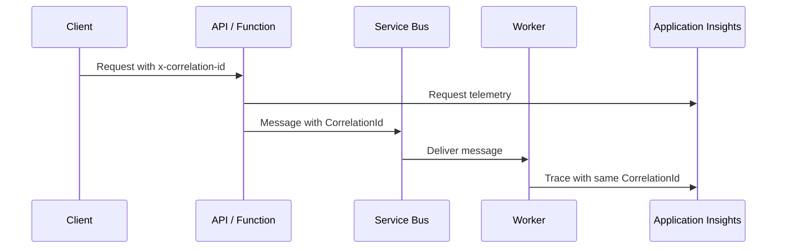

# Monitoring

## What It Is

Azure monitoring services collect metrics, logs, traces, dependencies, exceptions, availability
results, and alerts across applications and infrastructure.

Good monitoring is not "lots of logs." It is the ability to answer what failed, who was affected,
whether the system is recovering, and what support action is needed.

| Service                | Best fit                                                              |
| ---------------------- | --------------------------------------------------------------------- |
| Application Insights   | Application telemetry, distributed tracing, dependencies, exceptions. |
| Log Analytics          | Central KQL query store for logs and diagnostics.                     |
| Azure Monitor Metrics  | Platform and resource metrics.                                        |
| Alerts                 | Actionable notifications and automation.                              |
| Workbooks / Dashboards | Operational views for support and engineering teams.                  |

## When To Use It

- Use Application Insights for APIs, Functions, workers, and distributed tracing.
- Use Log Analytics for cross-resource query and diagnostics.
- Use alerts for symptoms users care about, not every noisy metric.
- Use correlation IDs across APIs, queues, workers, databases, and external calls.
- Use runbooks when an alert requires a repeatable support action.

## When Not To Use It

- Do not log secrets, tokens, full message bodies, or personal data without a clear policy.
- Do not keep verbose logs forever.
- Do not rely only on infrastructure metrics for application health.
- Do not create alerts that no one owns.
- Do not sample away the only traces needed for critical workflows without understanding the impact.

## What Breaks First In Production

- Correlation IDs are missing after the first async boundary.
- DLQ messages pile up because there is no alert.
- Logs contain technical messages but no safe business key for support.
- Alert rules fire but nobody has a runbook.
- Log Analytics costs grow because debug-level logs stay on in production.

## Correlation ID Pattern



## Structured Logging

Use structured properties instead of string-only logs.

```csharp
logger.LogInformation(
    "Processed {MessageType} for {EntityName} {EntityId}",
    "OrderSubmitted",
    "account",
    accountId);
```

Good production logs usually include:

- Correlation ID.
- Message ID.
- Safe business identifier.
- Source system.
- Target system.
- Operation name.
- Result and duration.

## Service Bus DLQ Monitoring

At minimum, alert on:

- Dead-letter message count greater than zero for critical queues.
- Age of oldest active message.
- Sudden increase in abandoned or lock-lost messages.
- Processor exceptions.
- Dependency failures inside message handlers.

## Failure Replay And Poison Messages

- Treat poison messages as expected operational events.
- Record why a message was dead-lettered.
- Keep replay tooling or runbooks outside the Azure Portal where possible.
- Do not replay messages until the root cause is understood.
- Replayed handlers must be idempotent.

## Dashboards And Workbooks

Useful dashboards show:

- API request volume, latency, and failures.
- Dependency failures by target.
- Service Bus active messages, DLQ count, and oldest message age.
- Function failures and execution duration.
- Top exceptions by operation.
- Recent deployments.

## Alert Rules

Prefer alerts that map to action:

| Alert                              | Action                                              |
| ---------------------------------- | --------------------------------------------------- |
| DLQ count greater than zero        | Triage poison messages and replay if safe.          |
| Oldest message age above threshold | Scale workers or investigate downstream dependency. |
| API 5xx spike                      | Check backend health and recent deployments.        |
| Dependency failure spike           | Check target system, throttling, or credentials.    |
| Key Vault access failures          | Check RBAC, firewall, identity, or secret expiry.   |

## Audit Logging

Audit logs matter for enterprise integration:

- Who submitted work.
- What system initiated the operation.
- What business entity was affected.
- Whether the operation succeeded, failed, or was replayed.
- Who performed manual replay or support actions.

Avoid storing sensitive payloads as audit data unless policy requires it.

## Cost Considerations

- Ingestion volume, retention, and high-cardinality logs drive cost.
- Verbose debug logs in production can be expensive.
- Logging full payloads increases both cost and security risk.
- Separate workspaces can help ownership but reduce cross-query simplicity.
- Sampling can reduce cost but must be understood for critical workflows.

## Operational Gotchas

- Application logs and platform logs often live in different places.
- Sampling can hide individual traces during high volume.
- Alerts without runbooks become noise.
- Dashboards that only engineers understand are weak support tools.
- No deployment marker means incidents are harder to link to releases.

## Production Checklist

- [ ] Application Insights configured.
- [ ] Correlation IDs flow across API, messages, workers, and dependencies.
- [ ] DLQ alerts configured.
- [ ] Structured logs include safe business keys.
- [ ] Runbooks exist for common alerts.
- [ ] Dashboards show failure paths.
- [ ] Log retention and sampling are intentional.
- [ ] Audit logging covers replay and support actions.

## Useful KQL

```kusto
traces
| where timestamp > ago(1h)
| where customDimensions.CorrelationId == "corr-123"
| order by timestamp asc
```

```kusto
exceptions
| where timestamp > ago(24h)
| summarize count() by operation_Name, type
| order by count_ desc
```

## Official Docs

- [Azure Monitor documentation](https://learn.microsoft.com/azure/azure-monitor/)
- [Application Insights documentation](https://learn.microsoft.com/azure/azure-monitor/app/app-insights-overview)
- [Log Analytics documentation](https://learn.microsoft.com/azure/azure-monitor/logs/log-analytics-overview)
