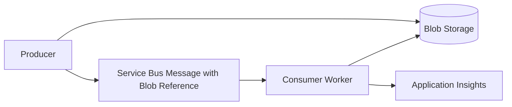

# Blob Claim-Check Pattern

## Problem Statement

A workflow needs to move large documents or payloads between systems, but the
message broker should carry metadata and routing information rather than the
entire payload.

## When To Use This Pattern

- Payloads are large documents, images, exports, or bulky JSON.
- Different consumers need controlled access to the payload.
- Payload retention differs from message retention.
- Message size limits or logging risk make inline payloads unsuitable.

## Recommended Azure Services

| Service | Role |
| --- | --- |
| Blob Storage | Stores the large payload. |
| Service Bus | Carries metadata and blob reference. |
| Azure Function or worker | Reads the blob and processes the payload. |
| Key Vault | Stores external credentials if needed. |
| Application Insights | Traces processing and failures. |

## Architecture Diagram

## Why These Services Were Chosen

- Blob Storage is durable and cost-effective for large objects.
- Service Bus keeps the workflow reliable without carrying large bodies.
- Workers can use Managed Identity to read only the required container.
- Lifecycle policies can clean old payloads independently.

## Alternatives Considered

| Alternative | Why not the default |
| --- | --- |
| Put payload in message | Hits size limits and increases logging/security risk. |
| Store payload in SQL | Expensive and awkward for large binary objects. |
| Use Event Grid only | Does not provide command queue semantics. |

## Security Considerations

- Prefer Managed Identity and RBAC over SAS tokens.
- Avoid long-lived SAS URLs in messages.
- Use private containers and private endpoints for sensitive workloads.
- Do not log blob contents or sensitive metadata.

## Monitoring Considerations

- Alert on missing blob failures.
- Track blob URI, message ID, and correlation ID.
- Monitor DLQ count and failed payload reads.
- Track lifecycle cleanup success.

## Cost Profile

Low to medium. Blob Storage is cost-effective, but costs increase with retention,
versioning, frequent reads, and high transaction volume.

## Operational Gotchas

- Consumers need defined behavior when the blob is missing or quarantined.
- Blob lifecycle cleanup must not delete payloads before replay windows expire.
- SAS token expiry can break delayed processing.
- Versioning and soft delete may increase retained storage.

## Production Readiness Checklist

- [ ] Blob container is private.
- [ ] Managed Identity access configured.
- [ ] Message contains stable blob reference and correlation ID.
- [ ] Lifecycle policy aligns to replay needs.
- [ ] Missing blob behavior documented.
- [ ] DLQ replay tested.

## Related Docs

- [Storage](../docs/storage.md)
- [Messaging](../docs/messaging.md)
- [Architecture Patterns](../docs/architecture-patterns.md)
