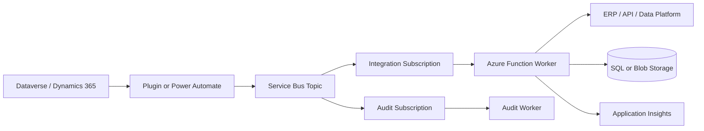

# Dataverse To Service Bus

## Problem Statement

Dataverse or Dynamics 365 needs to notify Azure services about business changes
without making the Dataverse transaction slow, fragile, or dependent on external
systems.

## When To Use This Pattern

- Dataverse changes need async processing in Azure.
- External systems are slower or less reliable than Dataverse.
- Multiple downstream consumers need the same business event.
- You need retry, DLQ, and replay outside the Dataverse transaction.

## Recommended Azure Services

| Service | Role |
| --- | --- |
| Dataverse plugin or Power Automate | Publishes change event. |
| Service Bus Topic | Durable business event fan-out. |
| Topic subscriptions | Independent consumer delivery state. |
| Azure Function | Subscriber worker and transformation logic. |
| Blob Storage or Azure SQL | Payload, audit, or integration state. |
| Application Insights | Correlated telemetry and support trail. |

## Architecture Diagram

## Why These Services Were Chosen

- Dataverse stays focused on the business transaction.
- Service Bus gives durable delivery, DLQ, and subscriber isolation.
- Azure Functions keep transformation and integration logic testable.
- Subscriptions allow audit, sync, and integration consumers to evolve
  independently.

## Alternatives Considered

| Alternative | Why not the default |
| --- | --- |
| Synchronous plugin calling API | Makes Dataverse depend on external latency and availability. |
| Direct Power Automate to target API | Can be fine, but harder to replay and govern at scale. |
| Event Grid | Useful for notification, weaker for durable business commands. |
| Data export only | Good for analytics, not command-style integration. |

## Security Considerations

- Use application users with least-privilege Dataverse security roles.
- Use Managed Identity for Azure resources.
- Avoid secrets in Dataverse configuration.
- Limit message content to required business data.
- Include row ID and logical table name without leaking sensitive fields.

## Monitoring Considerations

- Capture Dataverse correlation ID where available.
- Track publish failures and subscriber failures separately.
- Alert on DLQ count per subscription.
- Log table, operation, row ID, message ID, and correlation ID.

## Cost Profile

Low to medium. Service Bus and Functions are usually efficient. Costs increase
with high message volume, verbose logging, and multiple subscriptions.

## Operational Gotchas

- Synchronous Dataverse plug-ins should stay short.
- Service protection limits can appear during bulk operations.
- Message ordering is not guaranteed unless sessions are deliberately used.
- Replay can duplicate downstream writes unless consumers are idempotent.

## Production Readiness Checklist

- [ ] Integration user permissions reviewed.
- [ ] Message schema versioned.
- [ ] Idempotency key defined.
- [ ] Service Bus DLQ alert configured.
- [ ] Bulk update behavior tested.
- [ ] Replay procedure documented.
- [ ] Correlation IDs visible in Application Insights.

## Related Docs

- [Integration](../docs/integration.md)
- [Messaging](../docs/messaging.md)
- [Identity & Security](../docs/identity-security.md)
- [Architecture Patterns](../docs/architecture-patterns.md)
