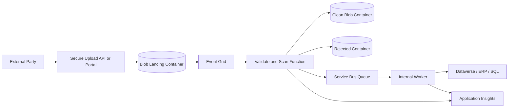

# DMZ-Safe Document Ingestion

## Problem Statement

External parties need to upload documents, but internal systems should not be
directly exposed to untrusted files, unknown payloads, or unreliable upload
clients.

## When To Use This Pattern

- Partners, portals, or users upload files into an enterprise process.
- Files need validation, malware scanning, classification, or approval.
- Internal systems must only receive clean, accepted documents.
- Upload and processing need auditability and replay.

## Avoid When

- The file source is already trusted and inside the same boundary.
- There is no requirement for validation, scanning, or audit.
- The team cannot support rejected-file handling.
- A simpler direct upload is enough and has acceptable risk.

## Recommended Azure Services

| Service                         | Role                                       |
| ------------------------------- | ------------------------------------------ |
| API Management or secure portal | Controlled upload entry point.             |
| Blob landing container          | Raw external upload zone.                  |
| Event Grid                      | Triggers validation on upload.             |
| Azure Function                  | Validates, scans, and classifies files.    |
| Clean Blob container            | Stores accepted files.                     |
| Service Bus Queue               | Starts internal processing.                |
| Worker service                  | Writes to Dataverse, ERP, SQL, or storage. |
| Application Insights            | Audit and operational telemetry.           |

## Architecture Diagram

## Why These Services Were Chosen

- Blob Storage provides a cheap, durable landing zone.
- Event Grid reacts to upload events without polling.
- Functions keep validation logic isolated.
- Service Bus decouples internal processing from upload timing.
- Separate containers make file state visible and auditable.

## Alternatives Considered

| Alternative                        | Why not the default                                          |
| ---------------------------------- | ------------------------------------------------------------ |
| Upload directly to internal system | Exposes trusted systems to untrusted input.                  |
| Email attachment ingestion         | Harder to secure, trace, and replay.                         |
| Logic Apps only                    | Good for workflow, but custom validation can become awkward. |

## Security Considerations

- Validate file type, size, extension, and content signature.
- Use malware scanning where required by policy.
- Keep landing and clean containers separate.
- Restrict upload permissions and expiry.
- Avoid public blob access.
- Keep audit logs for accepted and rejected documents.

## Monitoring Considerations

- Alert on validation failures and scan failures.
- Track rejected file counts.
- Monitor queue age and DLQ count.
- Log file hash, upload ID, source, validation result, and correlation ID.

## Cost Profile

Medium. Storage is low-cost, but scanning, logging, retention, and private
networking can add cost.

## Operational Gotchas

- File type validation by extension alone is not enough.
- Large uploads need timeout and retry planning.
- Rejected file handling must be clear for support teams.
- Lifecycle policies must respect audit and legal requirements.
- Teams often underestimate the support process for rejected files.
- In production, watch for files that pass upload but fail downstream schema or
  business validation.

## Production Readiness Checklist

- [ ] Upload authentication and authorization configured.
- [ ] Landing and clean zones separated.
- [ ] Validation and scan rules documented.
- [ ] Rejection process defined.
- [ ] Queue and DLQ monitoring configured.
- [ ] Audit trail implemented.
- [ ] Retention policy approved.

## Related Docs

- [Storage](../docs/storage.md)
- [Integration](../docs/integration.md)
- [Monitoring](../docs/monitoring.md)
- [Production Readiness Checklist](../docs/production-readiness-checklist.md)
