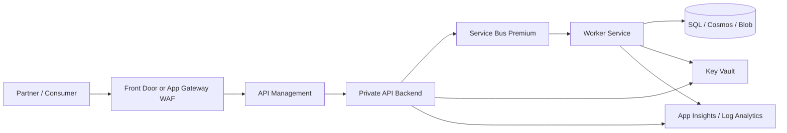

# Enterprise Secure Integration Stack

## Problem Statement

An enterprise integration platform needs secure API exposure, private backend access, durable
messaging, secret management, observability, and controlled deployment.

## When To Use This Pattern

- Multiple teams or partners consume APIs.
- Backends must remain private.
- Integration workloads are business-critical.
- Operations, audit, and security review are required.

## Recommended Azure Services

| Service                                   | Role                           |
| ----------------------------------------- | ------------------------------ |
| Front Door or Application Gateway         | Ingress, WAF, routing.         |
| API Management                            | API governance and policy.     |
| App Service, Functions, or Container Apps | API and integration compute.   |
| Service Bus Premium                       | Reliable isolated messaging.   |
| Private Endpoints                         | Private PaaS access.           |
| Key Vault                                 | Secrets and certificates.      |
| Azure SQL or Cosmos DB                    | Operational data.              |
| Application Insights and Log Analytics    | Observability and diagnostics. |
| Azure DevOps or GitHub Actions            | Controlled deployment.         |

## Architecture Diagram

## Why These Services Were Chosen

- The ingress tier handles edge protection and routing.
- API Management governs contracts, auth, throttling, and subscriptions.
- Service Bus Premium provides isolation and predictable messaging.
- Private Endpoints reduce public exposure.
- Central monitoring supports incident response and audit.

## Alternatives Considered

| Alternative               | Why not the default                                            |
| ------------------------- | -------------------------------------------------------------- |
| Direct public App Service | Weak API governance and exposure boundary.                     |
| Service Bus Standard      | Often fine, but less isolation for critical workloads.         |
| AKS                       | Useful when Kubernetes control outweighs platform overhead.    |
| Logic Apps only           | Good for workflows, not a full integration platform by itself. |

## Security Considerations

- Use OAuth 2.0 / Entra ID and validate JWTs at API Management.
- Use Managed Identity for Azure resource access.
- Use Key Vault for certificates and secrets.
- Prefer private endpoints for data stores and messaging.
- Separate runtime, deployment, and support permissions.

## Monitoring Considerations

- Track API failures, dependency failures, queue age, DLQs, and worker failures.
- Use distributed tracing across API, message, and worker.
- Build dashboards for support teams.
- Maintain runbooks for replay, rollback, and outage triage.

## Cost Profile

High compared with startup patterns. API Management, WAF, private networking, Service Bus Premium,
and Log Analytics all add baseline cost. The trade-off is governance, isolation, security, and
operational confidence.

## Operational Gotchas

- Private DNS can be the hardest part of private endpoint rollouts.
- API Management policies can hide backend errors if diagnostics are weak.
- Premium SKUs need capacity planning.
- Alerts must map to owners and runbooks.

## Production Readiness Checklist

- [ ] API ownership and versioning documented.
- [ ] Private DNS validated.
- [ ] Managed Identity and RBAC reviewed.
- [ ] Key Vault access reviewed.
- [ ] DLQ and dependency alerts configured.
- [ ] Runbooks created.
- [ ] CI/CD approvals configured.
- [ ] Cost ownership agreed.

## Related Docs

- [Integration](../docs/integration.md)
- [Identity & Security](../docs/identity-security.md)
- [Networking](../docs/networking.md)
- [DevOps](../docs/devops.md)
