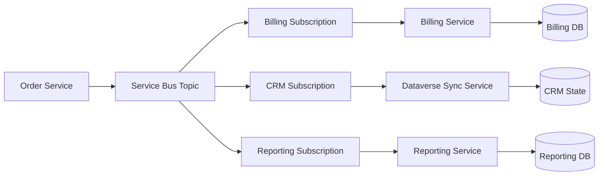

# Event-Driven Microservice

## Problem Statement

Multiple services need to react to business events without direct calls between services or shared
runtime availability.

## When To Use This Pattern

- Services should evolve independently.
- Each consumer needs its own retry and failure handling.
- Business events are useful to more than one downstream process.
- Temporary consumer outages should not block the publisher.

## Recommended Azure Services

| Service                           | Role                                    |
| --------------------------------- | --------------------------------------- |
| Service Bus Topic                 | Durable business event publication.     |
| Topic subscriptions               | Per-service delivery state and filters. |
| Azure Functions or Container Apps | Independent consumers.                  |
| Azure SQL or Cosmos DB            | Service-owned data store.               |
| Application Insights              | Cross-service telemetry.                |

## Architecture Diagram

## Why These Services Were Chosen

- Service Bus topics give durable fan-out for business events.
- Subscriptions isolate failures between consumers.
- Each service can own its data and deployment cadence.
- Consumers can replay from DLQ without asking the publisher to resend.

## Alternatives Considered

| Alternative                     | Why not the default                                                     |
| ------------------------------- | ----------------------------------------------------------------------- |
| Direct service-to-service calls | Creates runtime coupling and cascading failures.                        |
| Event Grid                      | Good for notification, less suited to command-like business processing. |
| Event Hubs                      | Better for streams and analytics than per-service business processing.  |

## Security Considerations

- Use separate identities per service.
- Grant sender and receiver permissions separately.
- Avoid broad namespace-level access when topic-level scope is enough.
- Keep event payloads minimal.

## Monitoring Considerations

- Monitor each subscription separately.
- Alert on DLQ count and oldest active message.
- Track event schema version.
- Correlate publisher event ID to consumer processing logs.

## Cost Profile

Medium. Costs grow with number of subscriptions, message volume, retries, and logging. Premium
Service Bus may be justified for predictable throughput.

## Operational Gotchas

- Event versioning matters once multiple consumers exist.
- Consumers must handle duplicate delivery.
- Adding a subscription creates a new operational owner.
- Overly broad event payloads leak data and create coupling.

## Production Readiness Checklist

- [ ] Event schema versioned.
- [ ] Subscription owners documented.
- [ ] Idempotency keys defined.
- [ ] DLQ alerts configured per subscription.
- [ ] Replay process tested.
- [ ] Consumer permissions scoped.

## Related Docs

- [Messaging](../docs/messaging.md)
- [Architecture Patterns](../docs/architecture-patterns.md)
- [Monitoring](../docs/monitoring.md)
