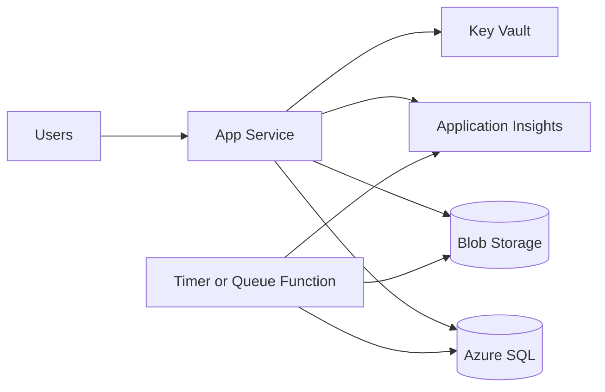

# Low-Cost Startup Azure Stack

## Problem Statement

A small product or internal tool needs to start on Azure without enterprise
cost, while still leaving a path to secure and scalable architecture later.

## When To Use This Pattern

- You need a pragmatic first production version.
- Traffic is modest or unpredictable.
- The team wants low operations overhead.
- The architecture should not block later growth.

## Avoid When

- You already need strict network isolation or WAF controls.
- The workload has high, predictable throughput.
- Multiple teams need governed API access.
- The app handles sensitive data without a clear security review.

## Recommended Azure Services

| Service                                  | Role                                   |
| ---------------------------------------- | -------------------------------------- |
| App Service Basic or Standard            | Hosts the web API or app.              |
| Azure Functions Consumption              | Runs scheduled or event-driven tasks.  |
| Azure SQL Basic/Serverless or PostgreSQL | Stores relational business data.       |
| Blob Storage                             | Stores files and exports.              |
| Key Vault                                | Stores secrets.                        |
| Application Insights                     | Basic telemetry and failure diagnosis. |
| GitHub Actions                           | CI/CD.                                 |

## Architecture Diagram

## Why These Services Were Chosen

- App Service and Functions keep operations simple.
- Azure SQL is a strong default for relational business data.
- Blob Storage handles files cheaply.
- Key Vault avoids hard-coded secrets from day one.
- GitHub Actions is enough for straightforward delivery.

## Alternatives Considered

| Alternative    | Why not the default                                         |
| -------------- | ----------------------------------------------------------- |
| AKS            | Too much platform overhead for a small workload.            |
| Cosmos DB      | Can be excellent, but partitioning and RU cost need care.   |
| API Management | Valuable later, but may be unnecessary baseline cost early. |
| Container Apps | Useful if containers are already part of the workflow.      |

## Security Considerations

- Use Managed Identity where supported.
- Store secrets in Key Vault.
- Use least-privilege database users or identities.
- Restrict public storage access.
- Add API Management later if partner/public API governance grows.

## Monitoring Considerations

- Enable Application Insights from the start.
- Alert on app failures and database saturation.
- Track dependency failures.
- Keep logs lean to avoid surprise ingestion costs.

## Cost Profile

Low. The main traps are oversized App Service plans, verbose Log Analytics
ingestion, always-on databases, and unused test environments.

## Operational Gotchas

- Cheap does not mean unmonitored.
- App settings can become secret sprawl without Key Vault.
- Serverless cold starts may matter for user-facing paths.
- Backups and restore testing still matter for small systems.
- This works well until the first external integration needs replay, audit, or
  stable API governance.
- Add Service Bus early if background work starts leaking into request paths.

## Production Readiness Checklist

- [ ] App Insights configured.
- [ ] Key Vault used for secrets.
- [ ] Backups enabled and restore tested.
- [ ] CI/CD pipeline configured.
- [ ] Basic alerts configured.
- [ ] Cost budget or alert created.

## Related Docs

- [Compute](../docs/compute.md)
- [Databases](../docs/databases.md)
- [DevOps](../docs/devops.md)
- [Production Readiness Checklist](../docs/production-readiness-checklist.md)
