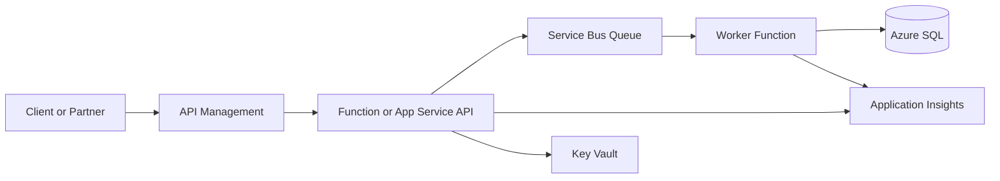

# Public API To Service Bus

## Problem Statement

An external or internal consumer needs to submit work through an API, but the backend processing is
slow, failure-prone, or dependent on downstream systems with rate limits.

## When To Use This Pattern

- The API can accept work asynchronously.
- The caller does not need the final result in the same HTTP request.
- Downstream systems need protection from traffic spikes.
- Failed work needs retry, dead-lettering, and replay.

## Recommended Azure Services

| Service                          | Role                                                         |
| -------------------------------- | ------------------------------------------------------------ |
| API Management                   | Public API boundary, JWT validation, throttling, versioning. |
| Azure Function or App Service    | Request validation and message publishing.                   |
| Service Bus Queue                | Durable async work buffer.                                   |
| Worker Function or Container App | Background processing.                                       |
| Azure SQL                        | Operational business data.                                   |
| Application Insights             | Request, dependency, trace, and failure telemetry.           |
| Key Vault                        | Secrets, certificates, external API credentials.             |

## Architecture Diagram

## Why These Services Were Chosen

- API Management keeps the public contract separate from the implementation.
- Service Bus protects the worker and downstream systems from bursts.
- A worker can retry safely without holding an HTTP connection open.
- Application Insights gives a full request-to-worker support trail.

## Alternatives Considered

| Alternative       | Why not the default                                          |
| ----------------- | ------------------------------------------------------------ |
| Direct API to SQL | Couples client latency to database and downstream work.      |
| Event Grid        | Better for notifications than business commands.             |
| Event Hubs        | Better for telemetry streams than command processing.        |
| Logic Apps        | Good for workflow, but less ideal for code-heavy validation. |

## Security Considerations

- Validate OAuth 2.0 JWTs in API Management.
- Authorize again in the application for business rules.
- Use Managed Identity to send Service Bus messages.
- Store external credentials in Key Vault.
- Do not log full request bodies if they contain sensitive data.

## Monitoring Considerations

- Track API request rate, failure rate, and latency.
- Alert on queue age, queue length, and DLQ count.
- Propagate `CorrelationId` from API to message to worker.
- Log business identifiers safely for support triage.

## Cost Profile

Medium. API Management adds baseline cost. Functions and Service Bus are usually cost-effective at
moderate volume. Logging can become a cost trap if request bodies or verbose traces are captured.

## Operational Gotchas

- Return `202 Accepted`, not `200 OK`, when processing is async.
- Make message handlers idempotent.
- Document DLQ replay before production.
- Avoid unbounded retries against partner systems.

## Production Readiness Checklist

- [ ] API contract and versioning agreed.
- [ ] JWT validation configured.
- [ ] Managed Identity used for Service Bus.
- [ ] DLQ alert configured.
- [ ] Correlation ID propagated.
- [ ] Replay process documented.
- [ ] Load and retry behavior tested.

## Related Docs

- [Integration](../docs/integration.md)
- [Messaging](../docs/messaging.md)
- [Monitoring](../docs/monitoring.md)
- [Production Readiness Checklist](../docs/production-readiness-checklist.md)
